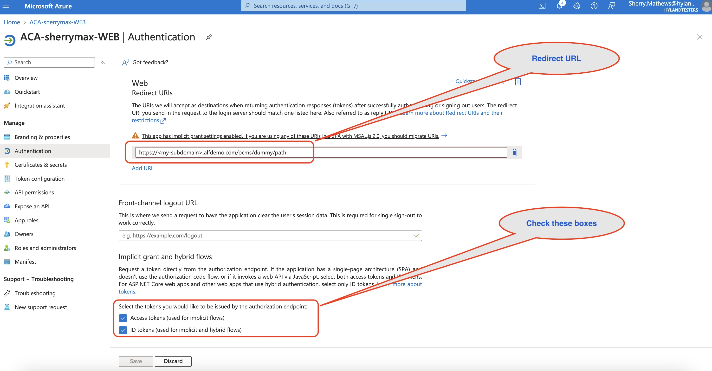
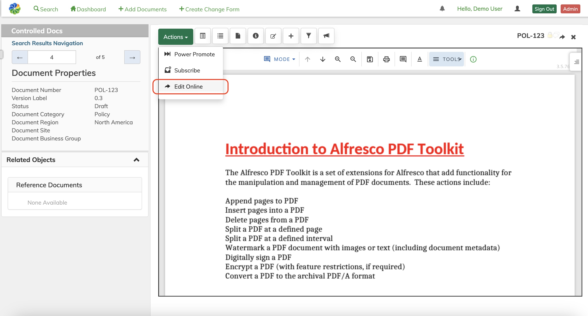

#### This article details the steps required to integrate Microsoft O365 with Alfresco Content Accelerator (ACA).

> **Note**: The integration is between Microsoft O365 and Alfresco Content Accelerator (ACA)

### Use-Case / Requirement
Users should be able to contribute and collaborate MS-Office Contents in Alfresco Content Accelerator (ACA) via O365.

### Prerequisites

* AWS Cloud Hosted Alfresco Content Services (Version 6.1 and above)
* AWS Cloud Hosted Alfresco Digital Workspace
* AWS EC2 Instance Details
* AWS Elastic Load Balancer
* O365 Account
* O365 Web App

## Configuration Steps

* Step 1: [Configure O365 Web App](https://github.com/sherrymax/acs-examples/tree/master/aca-O365-integration#configure-o365-web-app)
* Step 2: [Configure Alfresco Content Accelerator (ACA)](https://github.com/sherrymax/acs-examples/tree/master/aca-O365-integration#configure-alfresco-content-accelerator-aca-for-adporca-users)

### Configure O365 Web App

1. Login to https://portal.azure.com/#home using Alfresco Credentials.
2. Navigate to `App Registrations` within `Azure Services`.
   
3. Register your Web application. 
> **Note**: The Redirect URI will be `https://<your-subdomain>.alfdemo.com/ocms/dummy/path`

> **Note**: More than one Redirect URIs can be added to the list.

4. Click Register button.
5. Click the Web App that just got created.
6. Note the :
   * Application (client) ID

### Configure Alfresco Content Accelerator (ACA) (For ADP/Orca users)

1. Update the `ACA Admin > Stage `.

2. Do the below configurations for each 3 service.

   
3. Now the document should be good to `Edit Online`.

4. A popup will appear prompting login. Use the same login where the WEB app got created in Azure Portal. Once logged in, the cookies will be reused for same action in the future.

5. A new browser tab will open with the document in O365.

6. The changes are auto saved. Close the browser tab once changes are done.

7. Back to ACA Document Viewer and now the document should be good to `Check-In Online` or `Cancel Checkin`.

### ACS : RUN the DEMO

### References
* https://docs.alfresco.com/content-accelerator/latest/configure/integrations-and-addons/#microsoft-onedrive
