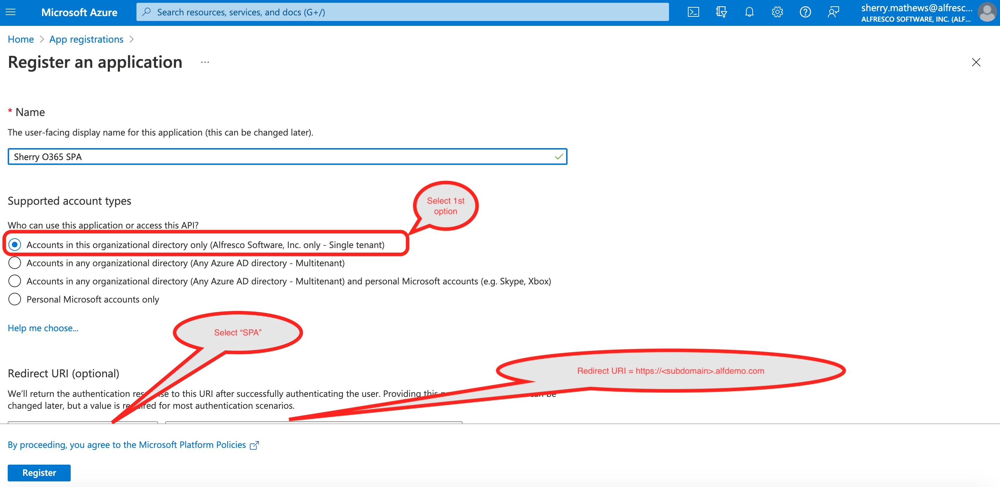
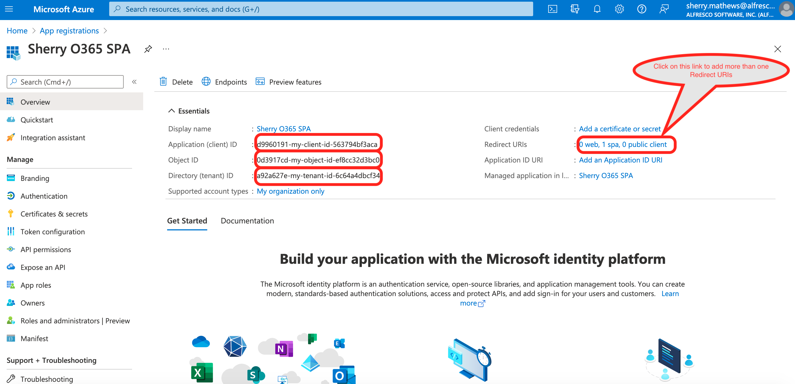

#### This article details the steps required to integrate Microsoft O365 with Alfresco Digital Workspace (ADW).

Note : The integration is between Microsoft O365 and Alfresco Digital Workspace (ADW)

### Use-Case / Requirement
Users should be able to contribute and collaborate MS-Office Contents in Alfresco Digital Workspace (ADW) via O365.

### Prerequisites

* AWS Cloud Hosted Alfresco Content Services (Version 6.1 and above)
* AWS Cloud Hosted Alfresco Digital Workspace
* AWS EC2 Instance Details
* AWS Elastic Load Balancer
* O365 Account
* O365 SPA

## Configuration Steps

* Configure AWS Elastic Load Balancer
* Configure O365 SPA
* Configure Alfresco Digital Workspace (ADW)
  
### Configure AWS Elastic Load Balancer

Run command:
```
./adp.py aws ec2 ssl
```
Once authenticated, start mapping the details from EC2 Instance.

* Please provide `region` you wish to use: `<region-of-your-ec2-instance>`
* Please specify the `elb_name` for this instance: `<myname-mycustomername>`
* Please specify the `ec2_public_dns` for this instance: `<Public-IPv4-DNS from AWS Instance Details Page>`
* Please specify the `instance_id` for this instance: `<Instance ID from AWS Instance Details Page>`
* Please specify the `subdomain` for this instance: `<mycustomername>`
* Please specify the `owner` for this instance: `<myname>`
* Please specify the `is_poc` for this instance: `<false>`
* Please specify the `target_end_date` for this instance: `<target_end_date>`
* Please specify the `elb_purpose` for this instance: `<demo>`
* Please specify the `customer` for this instance: `<mycustomername>`

Note: The Redirect URI will be `https://<subdomain>.alfdemo.com`

### Configure O365 SPA

1. Login to https://portal.azure.com/#home using Alfresco Credentials.
2. Navigate to `App Registrations` within `Azure Services`.
   
3. Register your SPA application. 
   The Redirect URI will be `https://<subdomain>.alfdemo.com`
4. Click Register button. 
5. Click the SPA that just got created.
6. Note the :
   1. Application (client) ID
   2. Object ID
   3. Directory (tenant) ID 


### Configure Alfresco Digital Workspace (ADW) (For ADP/Orca users)

1. Deploy the `Alfresco Microsoft 365 Connector` by running following command.
   ```
    ./adp.py deploy ooi
    ```
2. Verify the status and ensure the containers are up by running following command.
   ```
    ./adp.py status
    ```
3. Once the containers are up, run the command:
    ```
    vim /home/ec2-user/adp/data/services/nginx/html/digital-workspace/app.config.json
    ```
3. Search for property `msOnline`.
4. Update its value as follows.
   ``` properties
   "msOnline": 
    {
        "msHost": "https://<elb-host-name>/ooi-service/api/-default-/private/office-integration/versions/1/edit-sessions/",
        "msClientId": "<spa-client-id>",
        "msAuthority": "https://login.microsoftonline.com/<spa-tenant-id>",
        "msRedirectUri": "https://<elb-host-name>"
    }
   ```
5. Save the file. (First press `Escape`. Then press `:wq! + Enter`)
6. Navigate to level of `adp` by running following command.
   ```
    cd ../../../../../
    ```
7.  Restart `nginx` by running following command.
    ```
    ./adp.py restart nginx
    ```
8. Test the integration.


### ACS : RUN the DEMO

### References
https://docs.alfresco.com/officeonline/tasks/office-online-register-spa.html
https://docs.alfresco.com/microsoft-365/latest/install/#register-a-single-page-application-spa