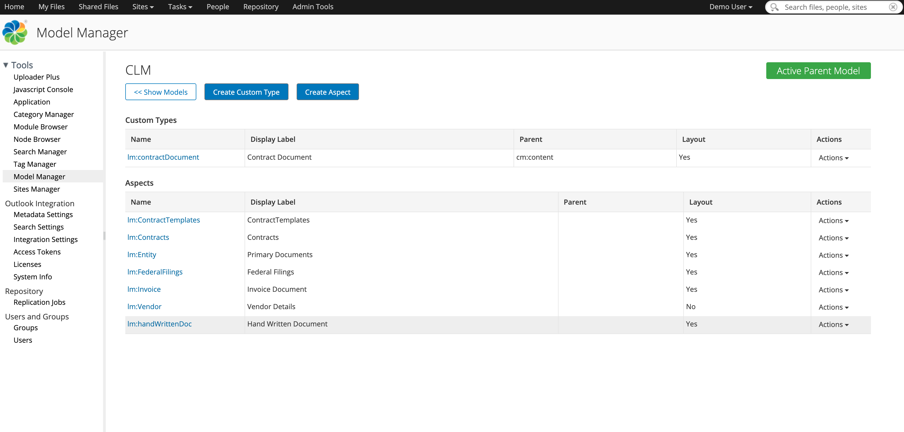

#### This article details the steps required to search a document using its metadata.

### Use-Case / Requirement
Neither the Regular Search nor the Live Search fom within Alfresco Share does search against custom fields/properties by default.  How can I search against my custom properties?

### Prerequisites to run this demo end-2-end

* Alfresco Content Services (Version 6.1 and above)

## Concepts

* <b>Simple Search :</b> The search field at the top right corner of the Share UI window is called the "Simple Search" field. 
* <b>Live Search :</b> From version 5.0 onwards, while typing first characters into that field the so called "Live Search" is triggered. ON pressing enter, the full search is triggered and all results for the entered search term are displayed.

In both cases, the search against documents with the text entered into the search field is limited to what is pre-configured in the out-of-the-box configuration.

## Configuration Steps
Download and Import a model to apply.
* [Contracts](../acs-model-examples/CLM.zip)



The default list of what is searched against for documents can be found in the following locations:

* /alfresco/templates/webscripts/org/alfresco/slingshot/search/live-search-docs.get.config.xml
* /alfresco/templates/webscripts/org/alfresco/slingshot/search/search.get.config.xml

```
Locations in ADP will be: 
1. adp/data/services/content/live-search-docs.get.config.xml
2. adp/data/services/content/search.get.config.xml
```

You can override these files and add to the fields listing that are searched against for finding documents in simple/live search.


## Steps to add custom properties to simple/live search

<b>Step 1: </b>Edit the configuration files and add your additional custom properties.  
    
Example : 
If you have properties `lm:ContractNumber` and `lm:ContractStatus`
For Simple Search : Change `search.get.config.xml` from
```xml
<search>
    <default-query-template>
        %(cm:name cm:title cm:description ia:whatEvent ia:descriptionEvent lnk:title lnk:description TEXT TAG)
    </default-query-template>
</search>
```
to
```xml
<search>
    <default-query-template>
        %(cm:name cm:title cm:description lm:ContractNumber lm:ContractStatus lnk:title lnk:description TEXT TAG)
    </default-query-template>
</search>
```
For Live Search : Change `live-search-docs.get.config.xml` from
```xml
<search>
    <default-operator>
        AND
    </default-operator>
    <default-query-template>
        %(cm:name cm:title cm:description TEXT TAG)
    </default-query-template>
</search>
```
to
```xml
<search>
    <default-operator>
        AND
    </default-operator>
    <default-query-template>
        %(cm:name cm:title cm:description lm:ContractNumber lm:ContractStatus TEXT TAG)
    </default-query-template>
</search>
```

> **Note**: If your property has a hyphen in the naming you will need to escape the hyphen character with a back-slash.

For example: If you wanted to add `sys:node-dbid` property, it should be added as `sys:node\-dbid`

```xml
<search>
   <default-query-template>
        %(cm:name cm:title cm:description sys:node\-dbid ia:whatEvent ia:descriptionEvent lnk:title lnk:description TEXT TAG)
    </default-query-template>
</search>
```

<b>Step 2: </b> Save the files and restart Alfresco
> **Note**: ADP Users should save the files followed by STOP and START of containers.


### ACS : RUN the DEMO

<b>Metadata Of a Document</b>

<b>Live Searching a Document using Metadata</b>


<b>Simple Searching a Document using Metadata</b>


### References
1. https://alfresco.my.salesforce.com/articles/en_US/Technical_Article/Can-we-add-custom-properties-into-the-properties-list-which-Share-Simple-Search-searches-against?popup=true
2. https://hub.alfresco.com/t5/alfresco-content-services-hub/share-advanced-search/ba-p/291116#Search_Forms