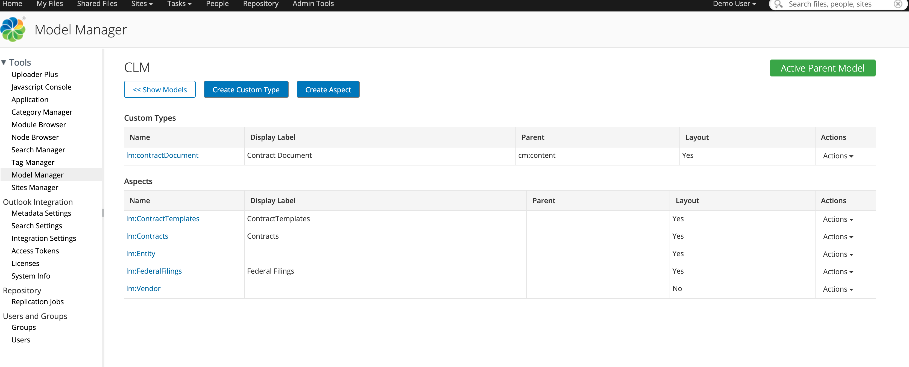
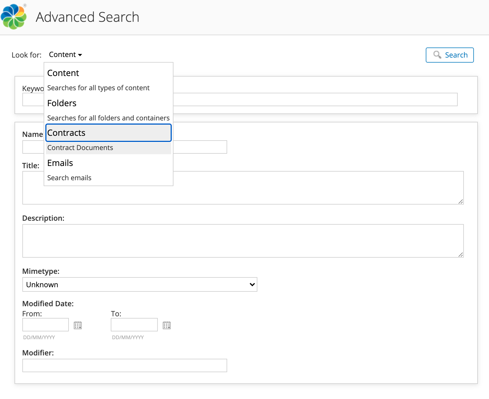
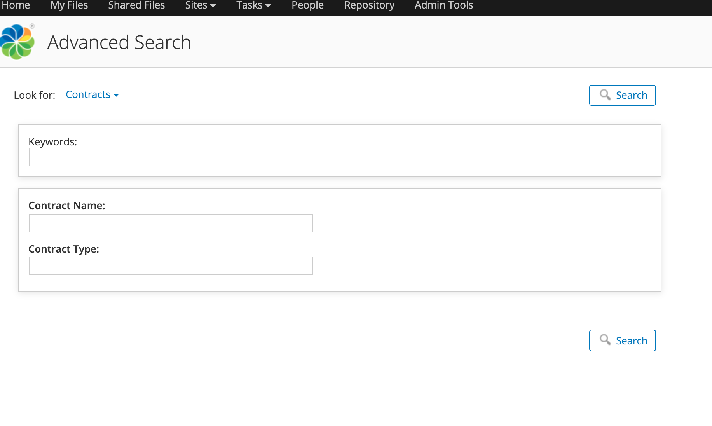

#### This article details the steps required to configure a custom Advanced Search template.

### Use-Case / Requirement
The admin user should be able to create a customised Advanced Search template for searching a specific document type (eg: Contract Document).

### Prerequisites to run this demo end-2-end

* Alfresco Content Services (Version 6.1 and above)

## Configuration Steps
1. Download and Import a model to apply.
* [Contracts](assets/CLM.zip)



2. The default list of what is searched against for documents can be found in the following locations:

* share-config.xml - This file lists the document type to be searched.
* share-form-config.xml - This file has the `search-form` where the user enters the search criteria.


> In ADP the location of files in SHARE container will be: 

```
1. /usr/local/tomcat/webapps/share/WEB-INF/classes/alfresco/share-config.xml
2. /usr/local/tomcat/webapps/share/WEB-INF/classes/alfresco/share-form-config.xml
```

These files have to be updated for a custom Advanced Search on a certain document type.


## Step 1: Update in share-config.xml
``` xml
<config evaluator="string-compare" condition="AdvancedSearch">
    <advanced-search>
        <!-- Forms for the advanced search type list -->
        <forms>
            <form labelId="search.form.label.cm_content" descriptionId="search.form.desc.cm_content">cm:content</form>
            <form labelId="search.form.label.cm_folder" descriptionId="search.form.desc.cm_folder">cm:folder</form>            
            <form label="Contracts" description="Contract Documents">lm:contractDocument</form>
        </forms>
    </advanced-search>
</config>
```


## Step 2 : Update in share-form-config.xml
``` xml
<!-- lm:Contracts type (new nodes) -->
<config evaluator="model-type" condition="lm:contractDocument">
    <forms>
        <!-- Search form -->
        <form id="search">
            <field-visibility>
                <show id="lm:contractName" force="true"/>
                <show id="lm:contractType" force="true" />
            </field-visibility>
            <appearance>
                <field id="mimetype">
                    <control template="/org/alfresco/components/form/controls/mimetype.ftl" />
                </field>
                <field id="cm:modifier">
                    <control>
                        <control-param name="forceEditable">true</control-param>
                    </control>
                </field>
                <field id="cm:modified">
                    <control template="/org/alfresco/components/form/controls/daterange.ftl" />
                </field>
            </appearance>
        </form>
    </forms>
</config>
```



## Save the files and restart Alfresco
> **Note**: ADP Users should save the files followed by STOP and START of SHARE container.


### ACS : RUN the DEMO


### References
1. https://ecmarchitect.com/alfresco-developer-series-tutorials/content/tutorial/tutorial.html#configuring-advanced-search-in-alfresco-share
2. https://hub.alfresco.com/t5/alfresco-content-services-hub/share-advanced-search/ba-p/291116#Search_Forms