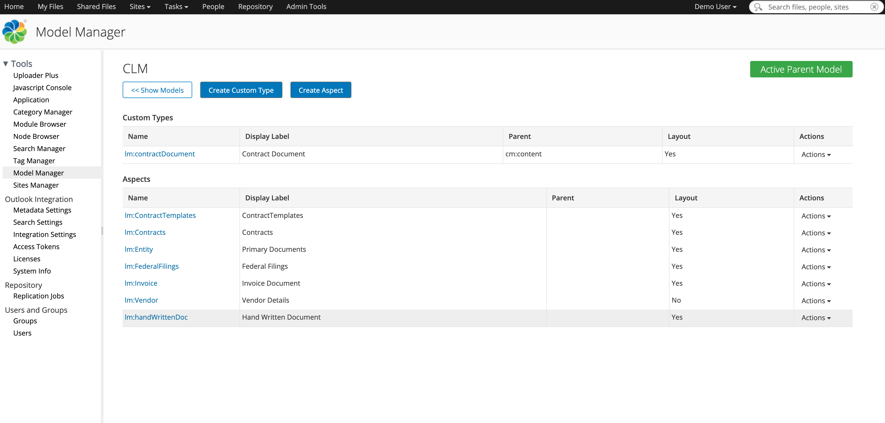
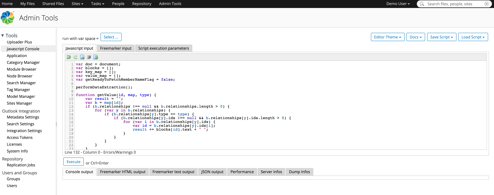
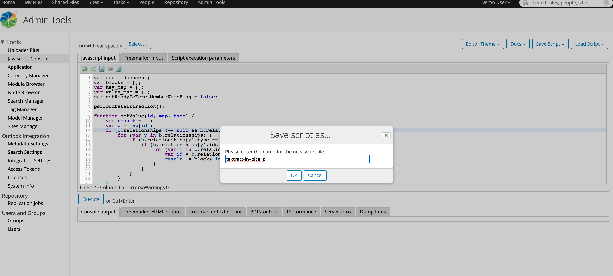
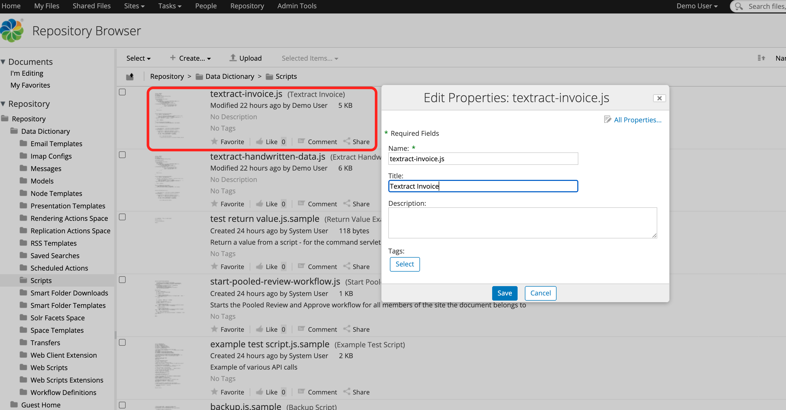
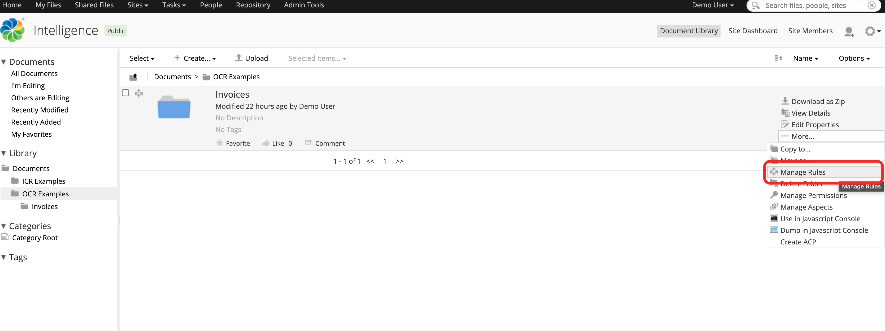
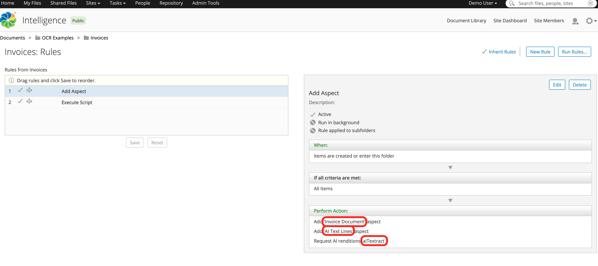
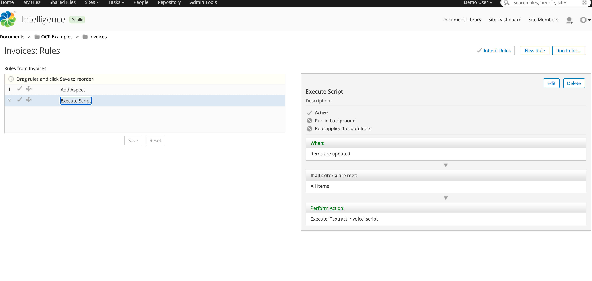
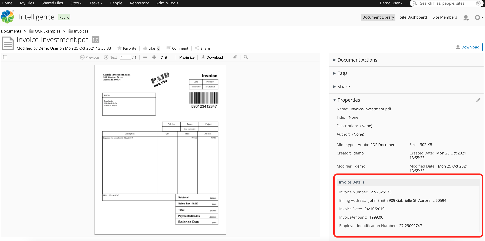

#### This article details the steps required to configure Alfresco Intelligence Service (AIS) to perform OCR usecases.

### Use-Case / Requirement
The Alfresco system should perform OCR on ingested documents and the extracted values should be available as metadata of ingested document.

### Prerequisites to run this demo end-2-end

* Alfresco Content Services (Version 6.1 and above)
* Alfresco Demo Platform (ADP) : Only for ADP Users

## Configuration Steps
1. Download and Import a model to apply.
* [Contracts](../acs-model-examples/CLM.zip)



2. Install/Deploy `Alfresco Intelligence Services`.
> Note: ADP Users should deploy AIS using `./adp.py deploy ai` followed by STOP and START of all containers.

3. Develop the Javascript for OCR extraction and updating the metadata.

<details>
    <summary>Expand this section for the javascript.</summary>

``` javascript
var doc = document;
var blocks = [];
var key_map = [];
var value_map = [];
var getReadyToFetchMemberNameFlag = false;

performDataExtraction();

function getValue(id, map, type) {
    var result = "";
    var b = map[id];
    if (b.relationships !== null && b.relationships.length > 0) {
        for (var y in b.relationships) {
            if (b.relationships[y].type == type) {
                if (b.relationships[y].ids !== null && b.relationships[y].ids.length > 0) {
                    for (var i in b.relationships[y].ids) {
                        var id = b.relationships[y].ids[i];
                        result += blocks[id].text + " ";
                    }
                }
            }
        }
    }
    return result;

}


function invokeUntilAvailable(renditionName) {
    var _rendition = getAISRendition();

    for (var i = 0;(_rendition == undefined || _rendition == null); i++) {
        _rendition = getAISRendition(renditionName);
        logger.info("COUNTER - " + i + " - IS RENDITION UNDEFINED ???  - " + (_rendition == undefined || _rendition == null));
    }

    return _rendition;
}

function getAISRendition(renditionName) {
    return renditionService.getRenditionByName(doc, renditionName);
}


function performDataExtraction() {


	//var aisRendition = renditionService.getRenditionByName(doc, "cm:aiTextract");
	var aisRendition = invokeUntilAvailable("cm:aiTextract");

    if (aisRendition !== undefined && aisRendition !== null) {
        logger.info("**** RENDITION IS VERY MUCH AVAILABLE ****");

        var rdoc = search.findNode(aisRendition.nodeRef);
        if (rdoc !== null && rdoc.content !== undefined) {


            var j = JSON.parse(rdoc.content);

            // Loop all blocks and construct an array of all blocks, one with all key blocks and one with all value blocks
            if (j !== undefined && j.blocks.length > 0) {
                for (var x in j.blocks) {
                    var block = j.blocks[x];
                    blocks[block.id] = block;


                    if (block.entityTypes !== null && block.entityTypes.length > 0) {
                        if (block.entityTypes[0] == "KEY") {
                            key_map[block.id] = block;
                        }
                        if (block.entityTypes[0] == "VALUE") {
                            value_map[block.id] = block;
                        }
                    }

                    if (block.blockType == "LINE") {
                        if ((block.text.match(/Name/gi)) && (doc.properties["tx:memberName"] == "")) {
                            getReadyToFetchMemberNameFlag = true;
                            continue;
                        }

                        if (getReadyToFetchMemberNameFlag) {
                            doc.properties["tx:memberName"] = block.text;
                            getReadyToFetchMemberNameFlag = false;
                        }
                    }


                    doc.save();


                }

            }


            // Loop all key blocks, lookup the value
            for (var k in key_map) {
                var kblock = key_map[k];
                var ktext = getValue(kblock.id, key_map, "CHILD");
                var value = "";
                if (kblock.relationships !== null && kblock.relationships.length > 0) {
                    for (r in kblock.relationships) {
                        if (kblock.relationships[r].type == "VALUE") {
                            for (i in kblock.relationships[r].ids) {
                                value += getValue(kblock.relationships[r].ids[i], value_map, "CHILD") + " ";
                            }
                        }
                    }
                }

                logger.info("\nKey: " + ktext + "\nValue: " + value + "\n");

                if (ktext.match(/^Profile/i)) {
                    doc.properties["lm:number"] = value;
                }

                if (ktext.match(/^Date/gi)) {
                    doc.properties["lm:invoiceDate"] = value;
                }

                if (ktext.match(/^Bill To/gi)) {
                    doc.properties["lm:address"] = value;
                }

				        if (ktext.match(/^Total/gi)) {
                    doc.properties["lm:amount"] = value;
                }

				        if (ktext.match(/^FEIN/gi)) {
                    doc.properties["lm:FEIN"] = value;
                }


                doc.save();


            }

            logger.log("\n--- **** **** **** ---\n");
        }

    } else {
        logger.info("**** RENDITION IS NOT YET AVAILABLE. AIS IS WORKING ON THE DOCUMENT ****");
    }

}


/*
	Example-Code-Start
    if (ktext.match(/as shown on your income tax return/gi) || ktext.match(/as shown on your income/gi) || ktext.match(/as sahowe on your income tae retum/gi)) {
    	doc.properties["tx:name"] = value;
        logger.info("\nFound income tax returning: " + ktext + "\nValue: " + value);
    }

	if (block.text.match(/^W-9$/gi)) {
        logger.info("Found W-9 in: " + block.text);
        doc.properties["tx:docType"] = block.text;
    }

	Example-Code-End
*/

```
</details>
<br/>

4. Javascript Images




4. Save and update the description of the Javascript.



5. Configure Folder Rules to:
    1. Add Aspects.
    
    2. Perform AI Renditions (AWS Textract).
    
    3. Execute javascript to update metadata.
    


### ACS : RUN the DEMO
Upload a [sample-invoice-document](assets/Invoice-Investment.pdf). <br/>
The resulting view :



### References
1. https://docs.alfresco.com/intelligence-services/latest/
2. https://docs.alfresco.com/intelligence-services/latest/config/textract/
3. https://docs.alfresco.com/intelligence-services/latest/admin/