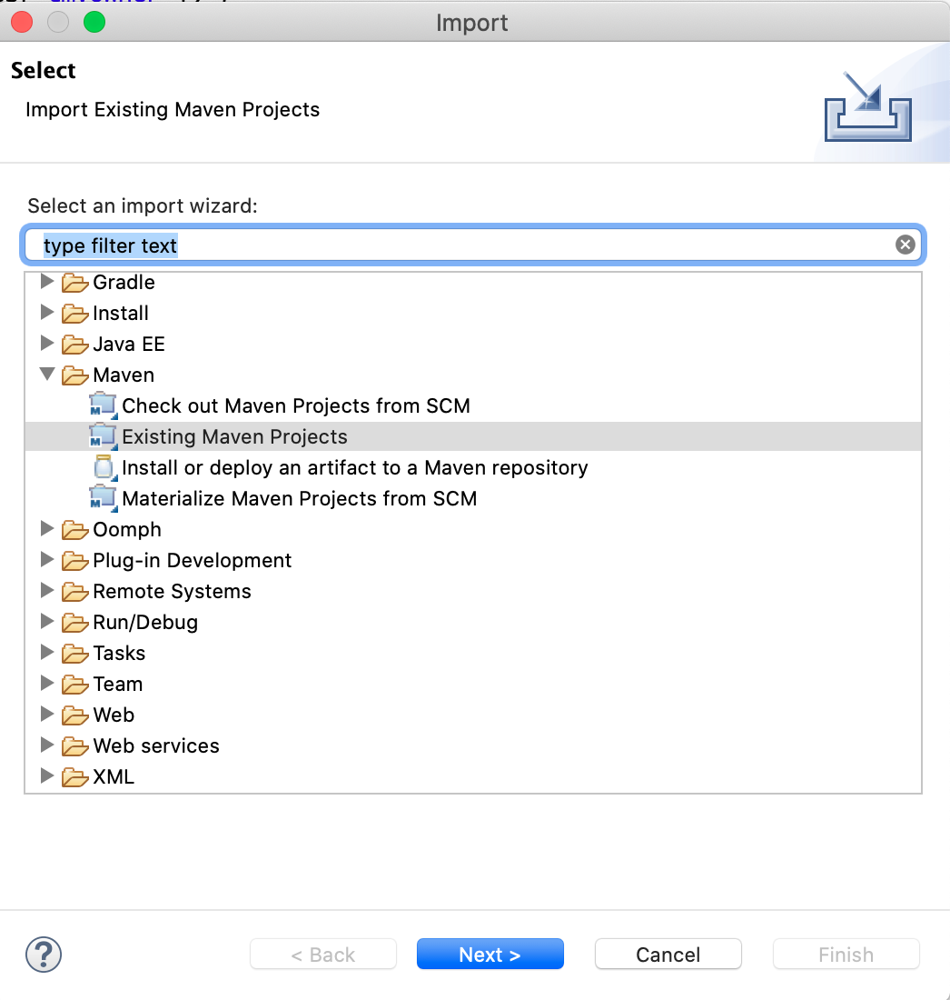
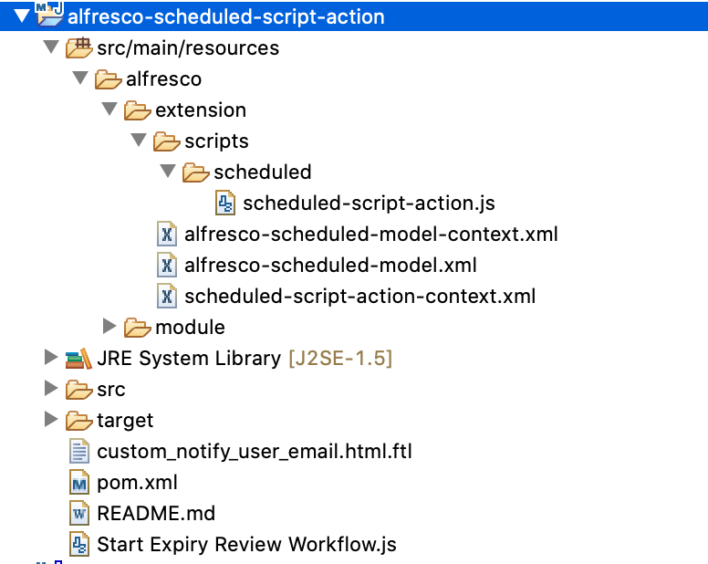
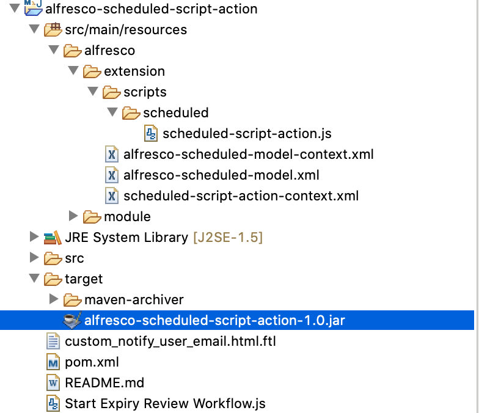
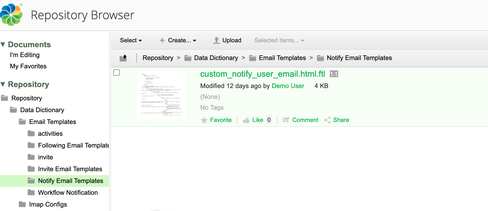
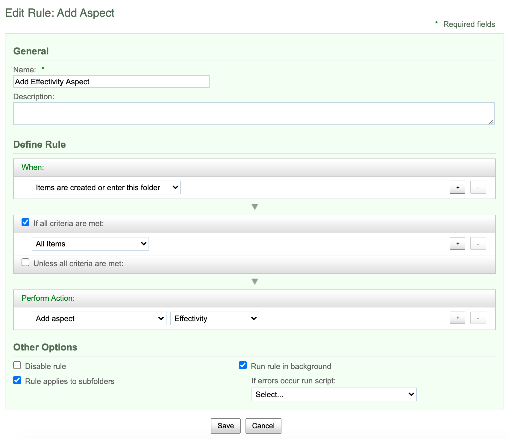
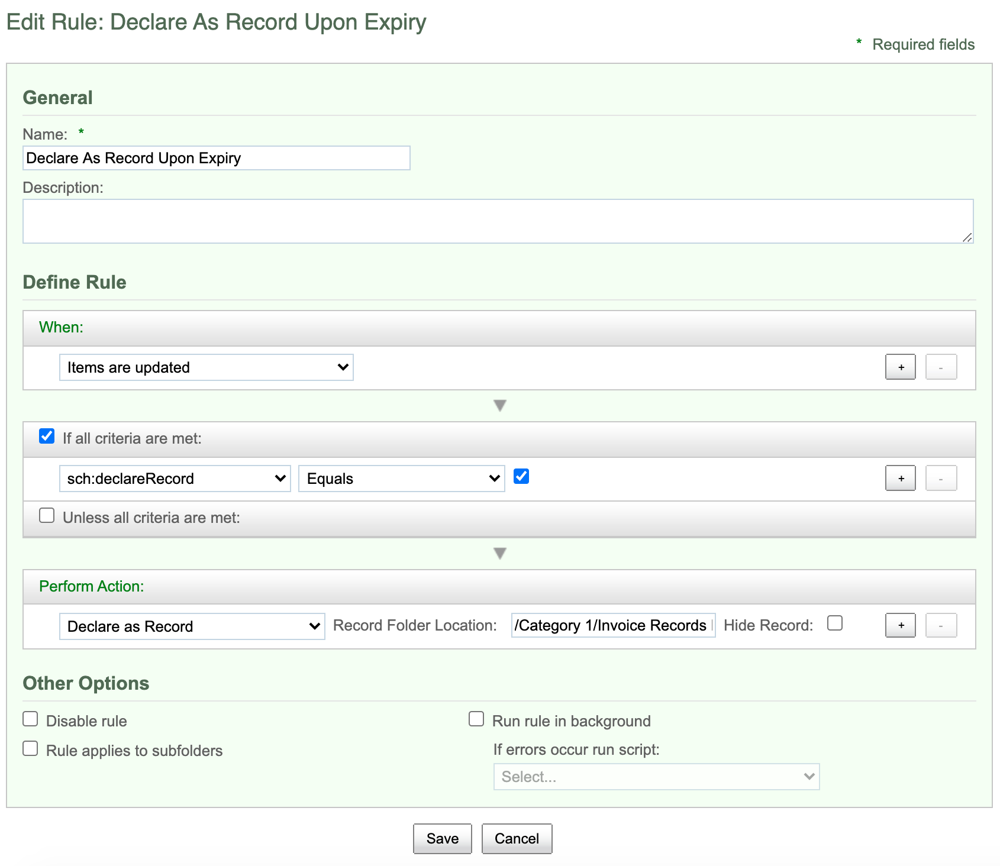

#### This article details the steps required to deal with contents that has an expiry date which is past current date.

### Use-Case / Requirement
Contents stored in ACS can have an `Effective Date` property. Once the current date is past the `Document Effective Date`, that document can be cosidered as expired. Alfresco can perform the following actions on such expired contents.

1. Trigger an email to creator/owner when a document is about to expire in the next 5 days.
2. Upon expiry, a document should be declared as a record.

### Prerequisites to run this demo end-2-end

* Alfresco Content Services (Version 6.1 and above)

## Configuration Steps

### ACS : Custom Script Development
1. Select `File >> Import >> Existing Maven Project` in Eclipse.

A Maven project for scheduler job is [available here](source-code/alfresco-scheduled-script-action).
2. Project is successfully imported.

3. Make source code changes and build jar file 
4. Run `mvn clean package` and view the `target` folder.



### ACS : Custom Script Deployment
1. Browse to the `classpathRoot` directory.
For example, for Tomcat 6, browse to the `$TOMCAT_HOME/shared/classes/` directory.

2. Update `alfresco-global.properties` as follows:
```
# Scheduled - Job
custom-scheduled-script.enabled=true
# Run every minute
custom-scheduled-script.cronExpression=0 * * * * ?
custom-scheduled-script.expire.notification.days=5
```

[A sample alfresco-global.properties file updated with scheduler is available here.](assets/alfresco-global.properties)

3. If you are using Orca, deploy the `alfresco-scheduled-script-action-1.0.jar` file to `/home/ec2-user/orca/data/services/content/custom`

4. Restart Content (ACS Server).

### ACS : Setup Email Template
1. A sample email template is available [here.](assets/custom_notify_user_email.html.ftl)
2. Upload the `Email Template` to this location


### ACS : Setup FOLDER RULES
1. Create a `Folder Rule` to add an aspect named `Effectivity`.

1. Create a `Folder Rule` to declare the expired content as record.


### ACS : DEBUG the changes

1. Navigate to Alfresco Admin console.
2. Change `org.alfresco.repo.jscript.ScriptLogger` set to level `DEBUG`.
3. View the logs.

### ACS : RUN the DEMO


### References
1. https://docs.alfresco.com/4.1/tasks/global-props-config.html