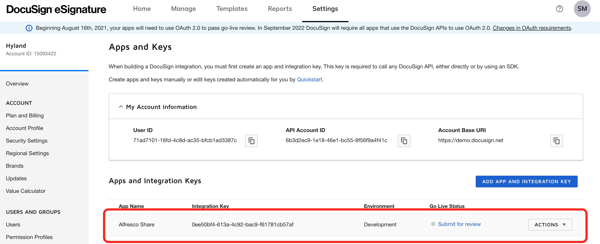
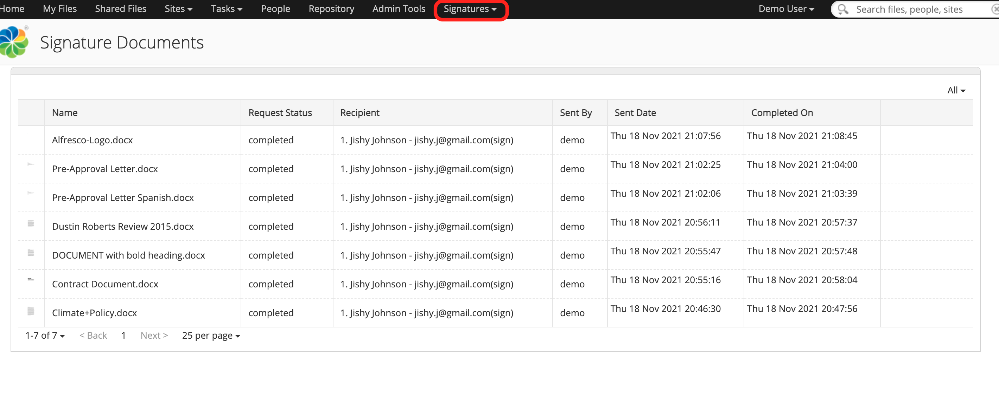

#### This article details the steps required to configure Alfresco Contents Services (ACS) to perform eSignature usecases using DocuSign.

### Use-Case / Requirement
The Alfresco system should perform eSignature on ingested documents using DocuSign.

> **Note**: Full credits and thanks to [boneill](https://github.com/boneill) for building this application. More details are available at https://github.com/boneill/alfresco-community-docusign.

### Prerequisites to run this demo end-2-end

* Alfresco Content Services (Version 6.1 and above)
* Alfresco Demo Platform (ADP) : Only for ADP Users
* [seedim-docusign-platform-1.0-SNAPSHOT.amp](assets/seedim-docusign-platform-1.0-SNAPSHOT.amp)
* [seedim-docusign-share-1.0-SNAPSHOT.amp](assets/seedim-docusign-share-1.0-SNAPSHOT.amp)
  
## ACS - Installation Steps

1. Copy the .amp files.
```
ADP/Orca users have to copy .amp in the following location:

adp/data/services/content/seedim-docusign-platform-1.0-SNAPSHOT.amp

adp/data/services/content/seedim-docusign-share-1.0-SNAPSHOT.amp

```
2. Restart ACS Server/Container.

## Docusign - Configuration Steps

1. Create a docusign account at [DocuSign Home](https://account.docusign.com/#/username).
2. Login to [Docusign Admin](https://admindemo.docusign.com/admin-dashboard) using the credentials created at Step # 1.
3. Navigate to [Apps and Keys](https://admindemo.docusign.com/apps-and-keys).
4. Note the Docusign USER ID.

5. Add and App by selecting `Add App and Integration Key`

6. Note down the `Integration Key`


7. Click on `Generate RSA` and Note down the `Private Key`.


8. Add a `Redirect URI` to the app. Preferably `http://localhost`


9.  The app will be listed.



## ACS - Configuration Steps

1. Once ACS has started, browse to `Repository > Data Dictionary`.
2. You should see a folder called `Docusign-Config`. 


3. Hover over it and click on `Edit Properties > All Properties`. The following form should be available.

4. Fill in the JWT Authentication details for your Docusign Account


    ```
    1. Docusign Client Id (API ID): <Integration-ID-of-your-App-from-Docusign>
    2. Docusign User Id: <YOUR Docusign USER ID>
    3. Target Account:FALSE
    4. Docusign Auth Server URL: `account.docusign.com`
    5. Docusign Private Key : The Private Key at the time of App creation must have been noted down.
    ```
5. An example of the filled form is as below:


> Note : Docusign Auth Server URL can be set to `account-d.docusign.com` for testing purposes.

### ACS : RUN the DEMO
1. Upload a document for esignature.
2. Request for signature

3. Fill in the Details for sending DocuSign

4. View the Signature Dashboard for status


### Troubleshooting

If the integration is still not working, your app needs Consent.

Perform the step, [mentioned in this document](https://developers.docusign.com/platform/auth/jwt/jwt-get-token/), if Consent is required.

```
https://account-d.docusign.com/oauth/auth?
    response_type=code
    &scope=YOUR_REQUESTED_SCOPES
    &client_id=YOUR_APP_INTEGRATION_KEY
    &redirect_uri=YOUR_APP_REDIRECT_URI
```
An example is as follows:
```
https://account-d.docusign.com/oauth/auth?
    response_type=code
    &scope=signature%20impersonation
    &client_id=0ee50bf4-613a-4c92-bac9-f61781cb57af
    &redirect_uri=http://localhost
```
The browser will provide a content box. Press `Accept` button.


### References
1. https://github.com/boneill/alfresco-community-docusign
2. https://developers.docusign.com/platform/auth/jwt/jwt-get-token/