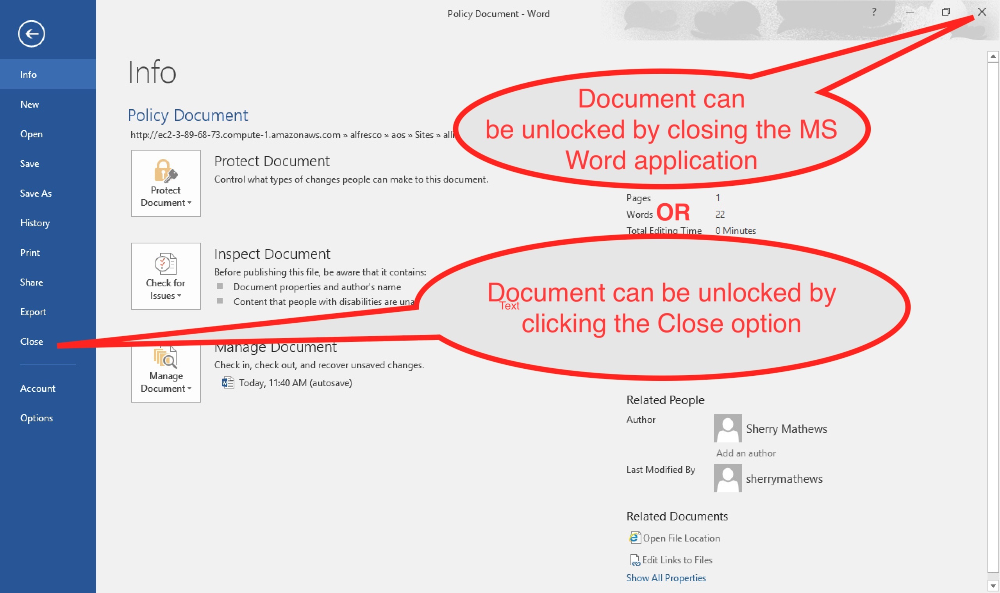

#### This article details the steps required to configure Edit in Microsoft Office 365 (Desktop Version) for Alfesco Share

### Use-Case / Requirement
The Alfresco system should let users edit Office documents in Share using MS Office 365 (Desktop Version).

### Prerequisites to run this demo end-2-end

* Alfresco Content Services (Version 6.1 and above)
* Alfresco Demo Platform (ADP) : Only for ADP Users

### Considerations when using Alfresco Office Services
  
```
Production, Staging, Development and POC Environments
-----------------------------------------------------
In these environments, Alfresco Office Services (AOS) is recommended to be configured on SSL to allow communication with the repository. You must activate SSL when using Alfresco Office Services in these environments. 
```

```
Sandbox and Demo environments
-----------------------------
Considering the need of these environments to be quickly setup, as an alternative to SSL communication, however, you would have to do some registry edits and establish the connection with the repository.
```


### Configuration Steps

1. Download and Import a [Policy Document](assets/Policy-Document.docx).

2. For <b>PROD, Staging, Dev and POC environments</b>:
   * Establish SSL. More details at [Alfresco Documentation](https://docs.alfresco.com/microsoft-office/latest/#considerations-when-using-alfresco-office-services).
  
3. For <b>Sandbox/Demo environments</b>: 
   * Download [basic-auth-bat-files.zip](assets/basic-auth-bat-files.zip) file.
   * Run [enable-basic-auth.bat](assets/enable-basic-auth.bat) file (as an Administrator) to enable Basic Authentication via registry edits. 

        > REG ADD HKCU\Software\Microsoft\Office\16.0\Common\Internet /v BasicAuthLevel /t REG_DWORD /d 2

   * Once testing is completed, if desired, run [disable-basic-auth.bat](assets/disable-basic-auth.bat) file (as an Administrator) to revert the changes and disable Basic Authentication.
   
        > REG DELETE HKCU\Software\Microsoft\Office\16.0\Common\Internet /v BasicAuthLevel /f

    * Please find the [documentation from Microsoft about this registry edit.](<https://docs.microsoft.com/en-us/office/troubleshoot/powerpoint/office-opens-blank-from-sharepoint>)

### ACS : RUN the DEMO
Alfresco Office Services (AOS) [supports following MS Office versions](https://docs.alfresco.com/microsoft-office/latest/install/#prerequisites-for-using-alfresco-office-services).

Step 1: Edit an office document in Microsoft Office.


Step 2: Confirm the action.


Step 3: Click on `Enable Editing`, if the document is opened in `Protected View`.


Step 4: Document is opened in Edit Mode.


Step 5: Make the edits.


Step 6: Save and confirm.


Step 7: The document is available with edits saved. But it is locked by same user, until MS Word is closed.


Step 8: Unlock the document by either way.


Step 9: The updated document is now available in Alfresco. 


Step 10 : Files stored in Alfresco can have lots of properties to help identify and track them. In Microsoft Windows, you can see these when you click the Info tab when you have a file open in Microsoft Office.
[More details on Alfresco File Properties in Microsoft Office](https://docs.alfresco.com/microsoft-office/latest/using/#alfresco-file-properties-in-microsoft-office)


### References
1. Alfresco Office Services (AOS) : https://docs.alfresco.com/microsoft-office/latest/
2. Using AOS : https://docs.alfresco.com/microsoft-office/latest/using/
3. Pre-requisites of AOS : https://docs.alfresco.com/microsoft-office/latest/install/#prerequisites-for-using-alfresco-office-services
4. Setting up SSL for AOS : https://docs.alfresco.com/content-services/latest/admin/auth-sync/
5. Mapping File Properties in AOS : https://docs.alfresco.com/microsoft-office/latest/using/#alfresco-file-properties-in-microsoft-office
6. Windows Registry Update for AOS : https://docs.microsoft.com/en-us/office/troubleshoot/powerpoint/office-opens-blank-from-sharepoint
7. Thoughts from Implementors : <https://www.algoworks.com/blog/integrate-alfresco-with-microsoft-office/>
