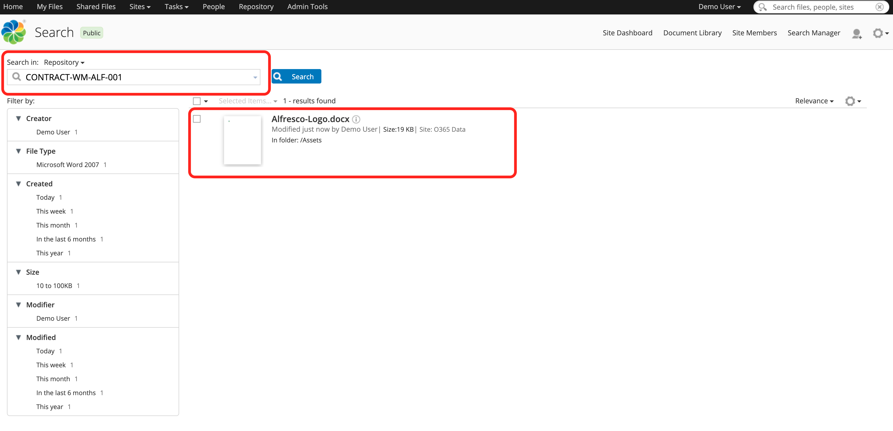
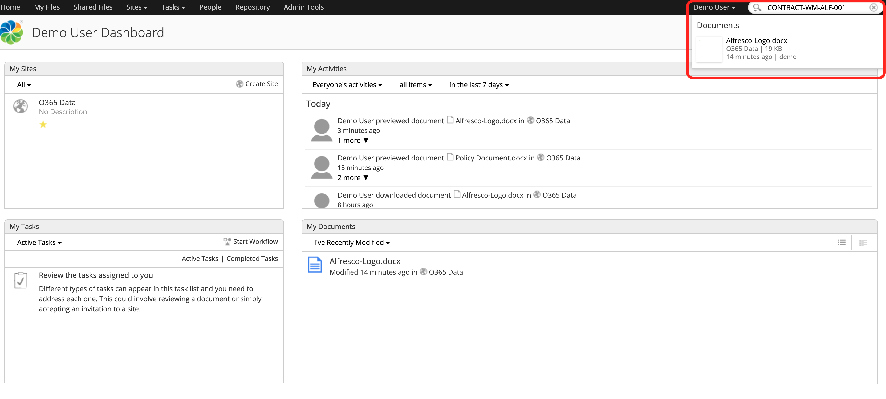
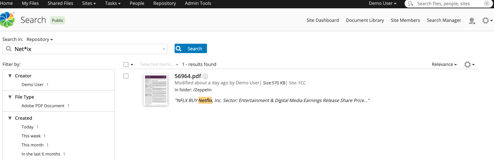
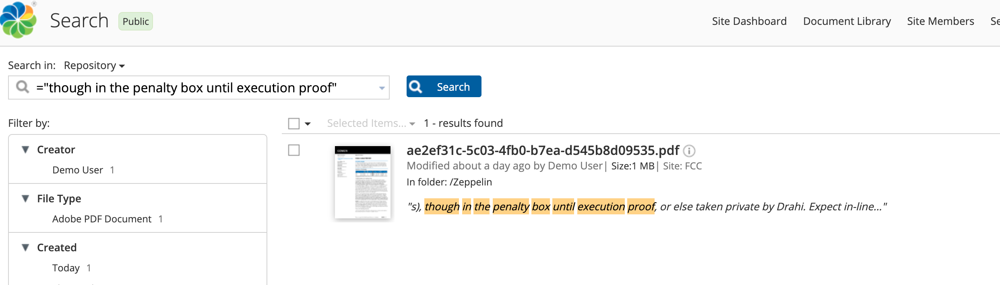
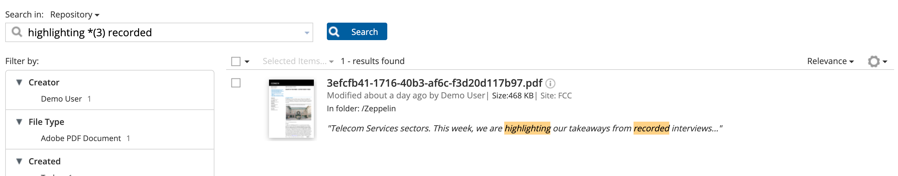
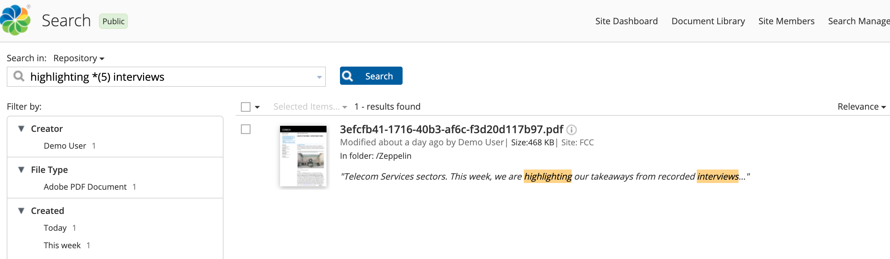
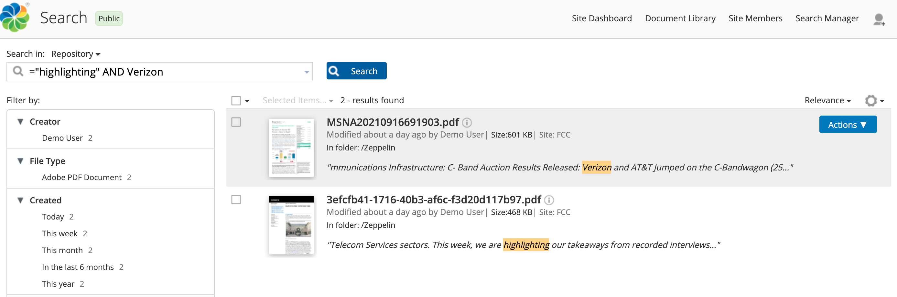
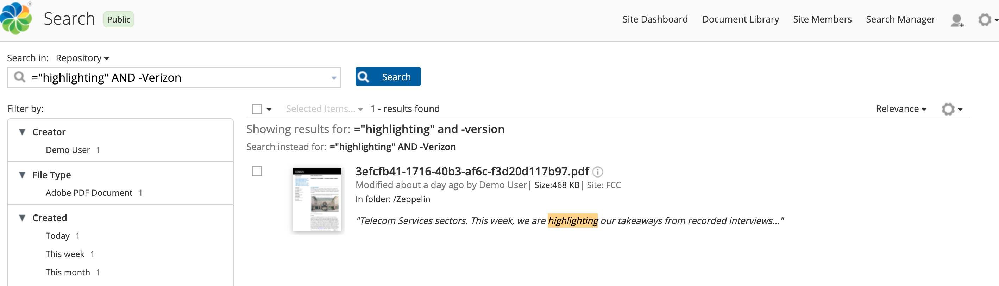
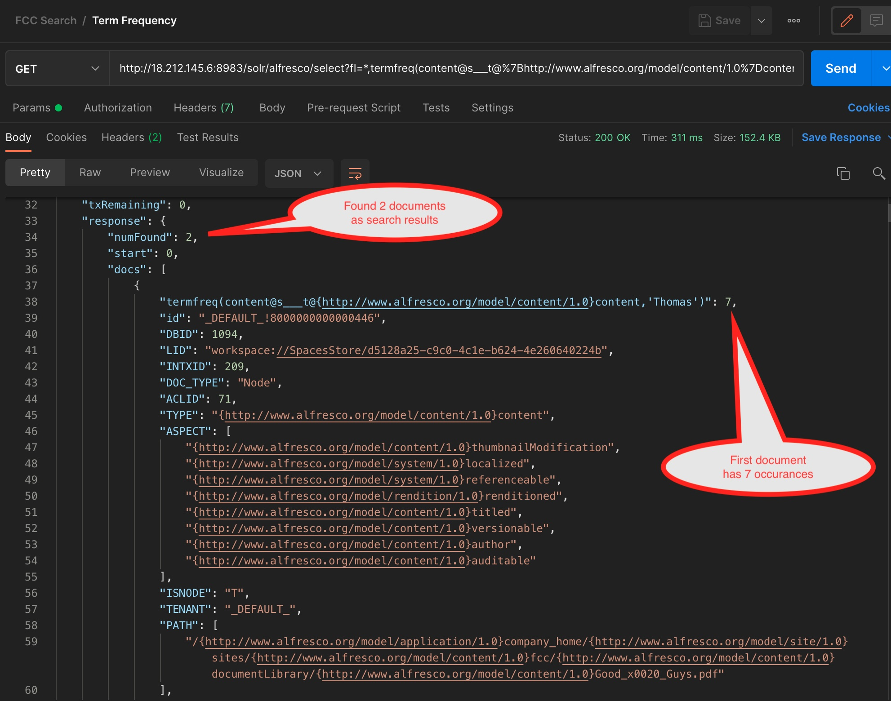
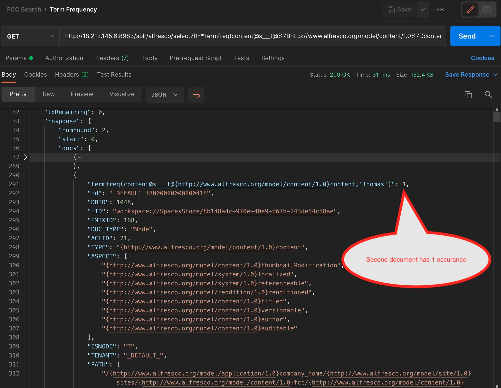

#### This article shows some examples of common full text searches that are useful for users

### Use-Case / Requirement

Users need to perform the following searches:

* Simple Search
* Live Search
* Wildcard Search
* Searching for exact phrase
* Proximity Search (3-word and 5-word)
* Negation Search
* Term Frequency

### Prerequisites to run this demo end-2-end

* Alfresco Content Services (Version 6.1 and above)

## Concepts

* <b>Simple Search :</b> The search field at the top right corner of the Share UI window is called the "Simple Search" field.

<b>Simple Searching a Document : even for a Metadata</b>

* <b>Live Search :</b> From version 5.0 onwards, while typing first characters into that field the so called "Live Search" is triggered. ON pressing enter, the full search is triggered and all results for the entered search term are displayed.

<b>Live Searching a Document using Metadata</b>

In both cases, the search against documents with the text entered into the search field is limited to what is pre-configured in the out-of-the-box configuration.

## Searches

<b>Wildcard Search :</b>

Official Documentation: <https://docs.alfresco.com/insight-engine/latest/using/sql/syntax/#search-for-wildcards>

<b>Searching for exact phrase :</b>

Official Documentation: <https://docs.alfresco.com/insight-engine/latest/using/sql/syntax/#search-for-an-exact-term>

<b>Proximity Search (3-word) :</b>

Official Documentation: <https://docs.alfresco.com/insight-engine/latest/using/sql/syntax/#search-for-proximity>

<b>Proximity Search (5-word) :</b>

Official Documentation: <https://docs.alfresco.com/insight-engine/latest/using/sql/syntax/#search-for-proximity>

<b>Negation Search :</b>

Official Documentation: <https://docs.alfresco.com/insight-engine/latest/using/sql/syntax/#search-for-negation>

<b>Term Frequency :</b>

### References

1. <https://docs.alfresco.com/insight-engine/latest/using/sql/syntax/>
2. <https://docs.alfresco.com/search-enterprise/latest/using/>
