#### This article details the steps required to setup an inbound email integration to Alfresco Content Services (ACS).

### Use-Case / Requirement
When an email with attachments is send to Alfresco, both the email and its attachments should be ingested into Alfresco

### Prerequisites to run this demo end-2-end

* Alfresco Content Services (Version 6.1 and above)
* Email Client : e.g. [Thunderbird](https://www.thunderbird.net/en-GB/)

## Configuration Steps for ADP Users
1. Setup an ADP environment with ACS.
2. Install a thick email client : e.g. [Thunderbird](https://www.thunderbird.net/en-GB/)
3. Configure `Account Settings` in Thunderbird
  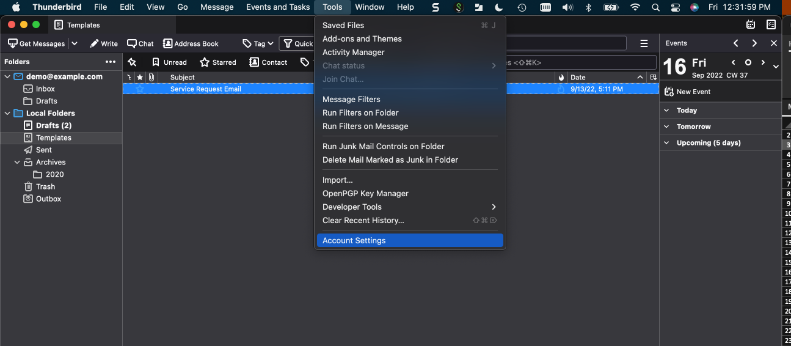
  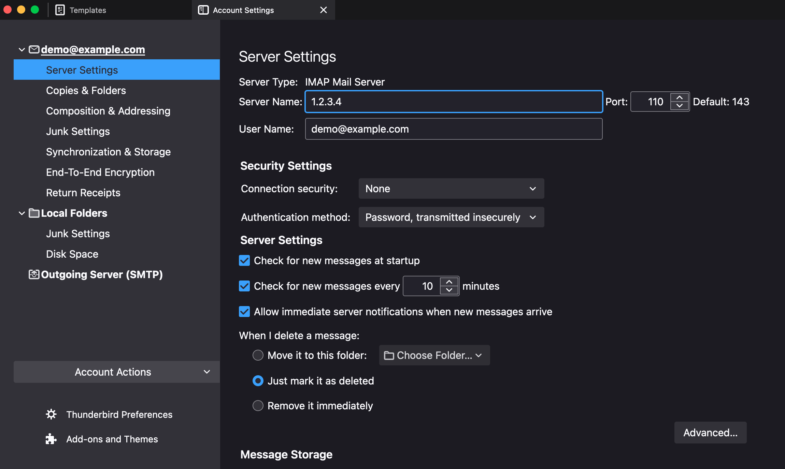
   > Note : Please use port # 143, in case of any issues with port # 110.

   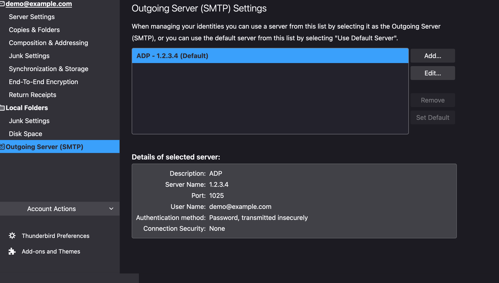
  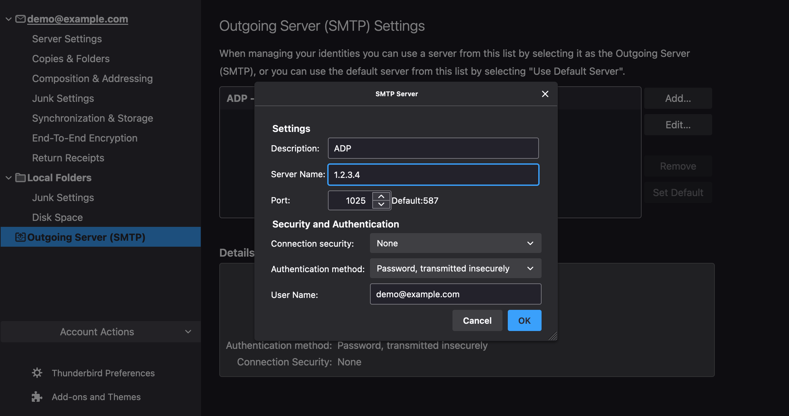

## 1. Update the alfresco-global.properties
Set the following properties in the `<TOMCAT\_HOME\>/shared/classes/alfresco-global.properties` file:

```properties
# Alfresco Email Service and Email Server
#-------------

# Enable/Disable the inbound email service.  The service could be used by processes other than
# the Email Server (e.g. direct RMI access) so this flag is independent of the Email Service.
#-------------
email.inbound.enabled=true

# Email Server properties 
#-------------
email.server.enabled=true
email.server.port=25
email.server.domain=ec2-1-2-3-4.compute-1.amazonaws.com
email.inbound.unknownUser=anonymous

# A comma separated list of email REGEX patterns of allowed senders.
# If there are any values in the list then all sender email addresses
# must match.  For example:
#   .*\@alfresco\.com, .*\@alfresco\.org
# Allow anyone:
#-------------
email.server.allowed.senders=.*
```

## 2. Restart ACS Server/Container
``` python
./adp.py stop content
./adp.py start content
```
## 3. Update the Group Membership
Add the user to `EMAIL_CONTRIBUTORS` group. 
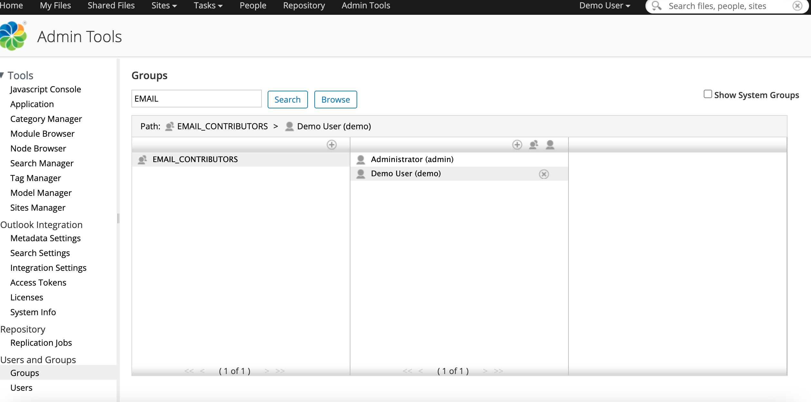

## 4. Configuration Step in ADP (Only for ADP Users)
```
Location to deploy alfresco-global.properties in ADP will be: 
* adp/data/services/content/alfresco-global.properties
```
## 5. Configure a Folder to be Email Inbox
  * Create a Folder. eg: `Email Inbox`
  * Manage Aspects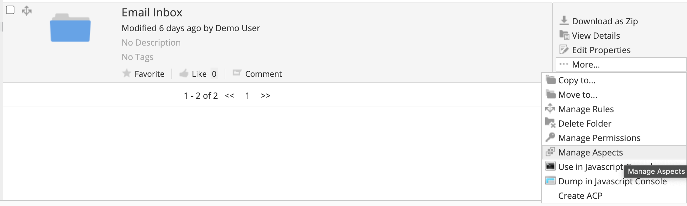
  * Add `Email Alias` Aspect 
  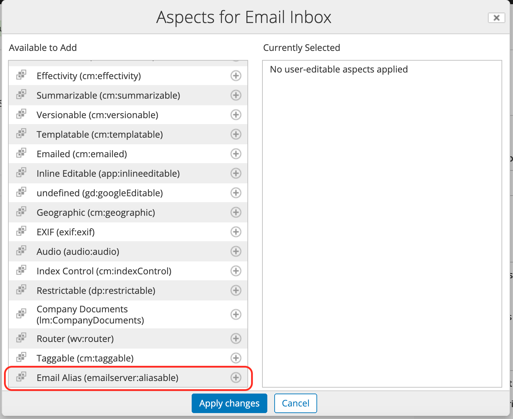
  Click `Apply Changes` button.
  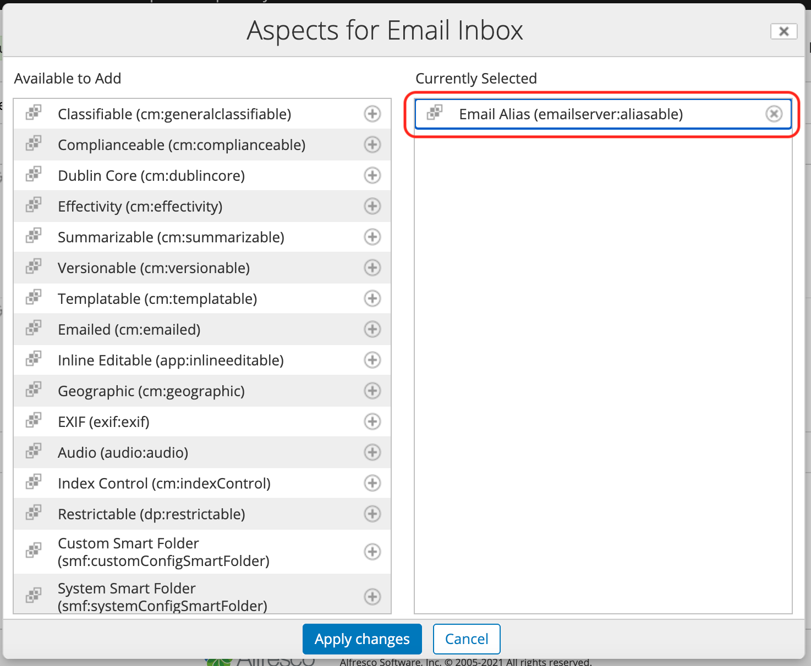
  * Edit Folder Properties 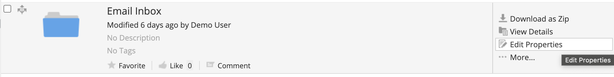
  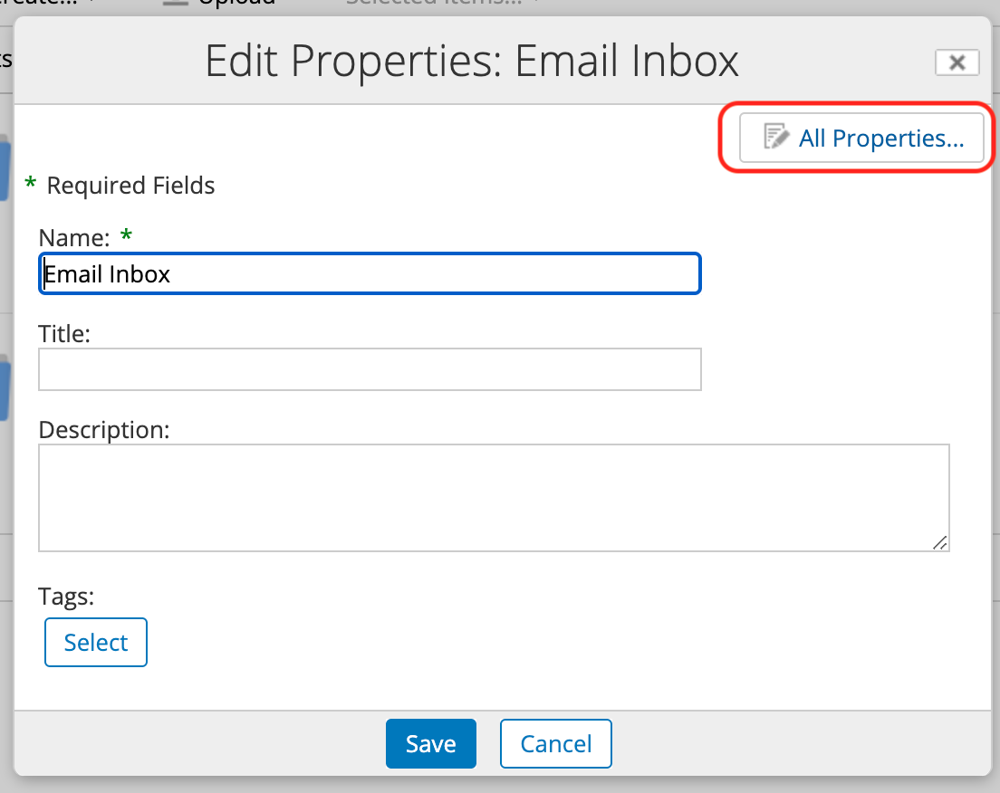
  * Provide an email alias name. eg: `servicerequestdocs`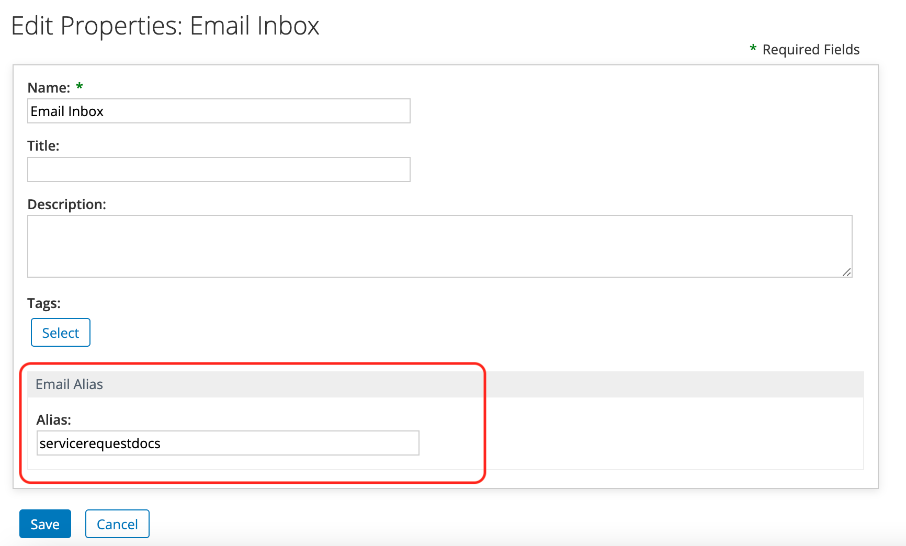
* The email with attachments should be send to `servicerequestdocs@example.com` 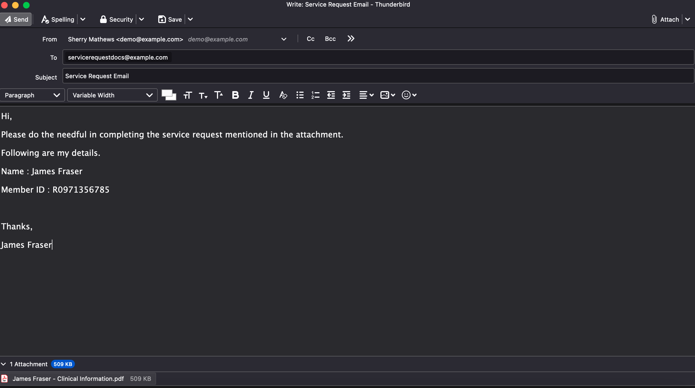


## Run the DEMO

## References
* [https://docs.alfresco.com/content-services/latest/config/email/](https://docs.alfresco.com/content-services/latest/config/email/)
* [http://keytocontent.blogspot.com/2010/05/upload-files-to-alfresco-via-email.html](http://keytocontent.blogspot.com/2010/05/upload-files-to-alfresco-via-email.html)
* [https://www.youtube.com/watch?v=p17GkHsLdmc](https://www.youtube.com/watch?v=p17GkHsLdmc)
