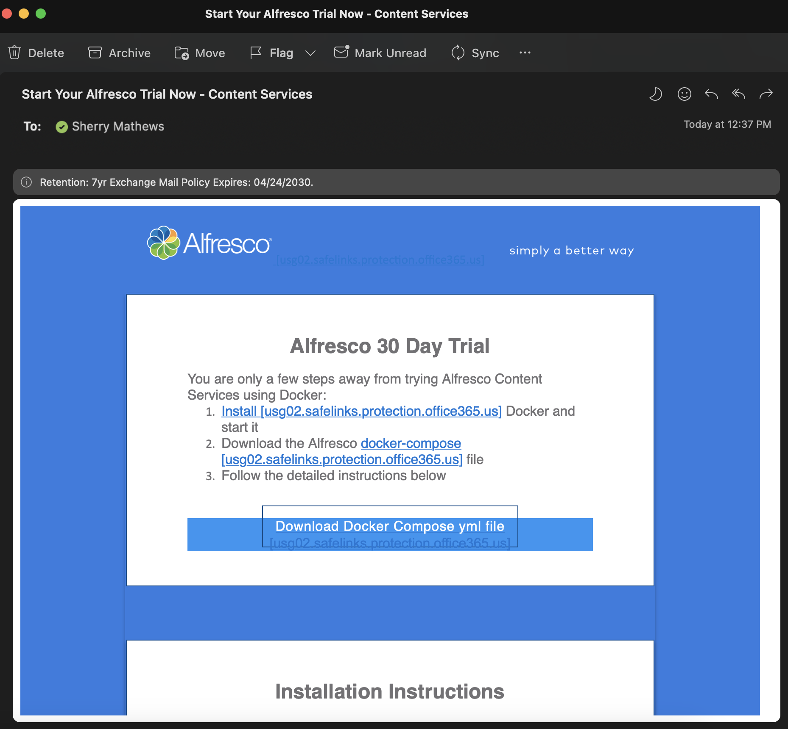

#### This article details the steps required to install Alfresco Content Services - Enterprise (ACS) using Docker Compose.

### Use-Case / Requirement
An Enterprise edition of Alfresco Content Services has to be installed using Docker Compose.

### Prerequisites to run this demo end-2-end

* Alfresco Content Services Enterprise License - A [30-day Free trial license](https://www.alfresco.com/platform/content-services-ecm/trial/download) is also available from Alfresco.
* An [Amazon Linux](https://aws.amazon.com/amazon-linux-ami/) EC2 instance is used to install Alfresco in this article.
* Login credentials to [Quay.io](https://quay.io/repository/) that holds container images of Alfresco Enterprise Edition.
> Note: If you've requested for a [30-day Free trial license](https://www.alfresco.com/platform/content-services-ecm/trial/download), please wait for the email from Alfresco with details, as shown below.


## Installation Steps
1. Create an [Amazon Linux](https://aws.amazon.com/amazon-linux-ami/) EC2 instance.
   ```
   CPU : t3.2xlarge
   Storage : 100GB
   ```
   

2. Connect to the Amazon Linux EC2 Instance.
   ```
   ssh -i "my-aws.pem" ec2-user@ec2-1-2-3-4.compute-1.amazonaws.com
   ```

3. Switch to `root` user for all installation privileges.
   ```
   sudo su
   ```

4. Install `Docker` on the connected Amazon Linux EC2 Instance.
   ```
   yum install docker
   ```

5. Install `docker-compose` on the connected Amazon Linux EC2 Instance.
   ```
   wget https://github.com/docker/compose/releases/latest/download/docker-compose-$(uname -s)-$(uname -m)
   sudo mv docker-compose-$(uname -s)-$(uname -m) /usr/local/bin/docker-compose
   sudo chmod -v +x /usr/local/bin/docker-compose
   ```

6. Enable `Docker Service`.
   ```
   sudo systemctl enable docker.service
   ```

7. Start `Docker Service`.
   ```
   sudo systemctl start docker.service
   ```   

8. Create a folder with name `alfresco`.
   ```
   mkdir /alfresco
   cd /alfresco
   ```

9. Upload the `docker-compose.yaml` file to the above `alfresco` folder.
   > Note: For 30 day Enterprise Trial, the `docker-compose.yaml` can be downloaded from the link given in the email response from Alfresco.

10. Note the login credentials to [Quay.io](https://quay.io/repository/).
    > Note: For 30 day Enterprise Trial, the `quay login credentials` is available in the email response from Alfresco.
    > Note: Only the encrypted password has to be used.

11. Run the following command to login to Quay.io.
    ```
    docker login quay.io -u="<quay-login-username>"
    ```

12. Enter the `quay-login-encrypted-password` when prompted.
    > Note: For 30 day Enterprise Trial, the `quay login encrypted password` is available in the email response from Alfresco.

13. Run the following command to start downloading container images.
    ```
    docker-compose up &
    ```
    > Note: It will take around 10 minutes to download images and get them started.

14. Run the following command to verify status.
    ```
    docker ps -a
    ```

15. Navigate to the following URLs to open Alfresco.
    ```
    http://<hostname>:8080/alfresco
    http://<hostname>:8080/share
    ```

### TIP
Run this command to START containers
```
docker-compose up
```

Run this command to STOP containers
```
docker-compose down
```

Run this command to REBUILD with clear cache and RESTART
```
docker-compose down && docker-compose build --no-cache && docker-compose up
```

### References
1. Alfresco Installation using Docker Compose : https://docs.alfresco.com/content-services/latest/install/containers/docker-compose/
2. How to install Docker on Amazon Linux 2 : https://www.cyberciti.biz/faq/how-to-install-docker-on-amazon-linux-2/
3. Top 15 Docker Commands : https://www.edureka.co/blog/docker-commands/
