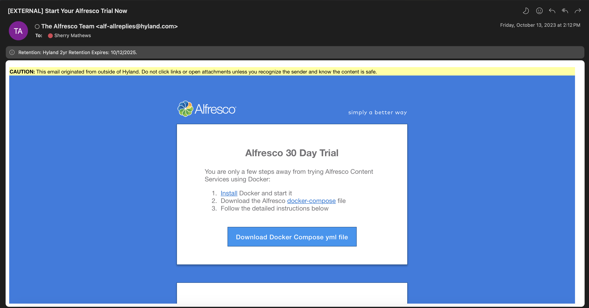

#### This article details the steps required to install Alfresco Content Services - Enterprise (ACS) on Azure Kubernetes Services (AKS) using Helm Charts.

### Use-Case / Requirement
An Enterprise edition of Alfresco Content Services with SOLR has to be installed on Azure Kubernetes Services (AKS) using Helm Charts.

### Prerequisites to ACS Installation

* Alfresco Content Services Enterprise License - A [30-day Free trial license](https://www.alfresco.com/platform/content-services-ecm/trial/download) is also available from Alfresco.
* An [Azure - Kubernetes Cluster (AKS)](https://azure.microsoft.com/en-us/solutions/linux-on-azure/ubuntu/) is used to install Alfresco in this article.
* [Helm Charts](https://github.com/Alfresco/acs-deployment/tree/v6.0.2/helm/alfresco-content-services) from Alfresco Repo are used.
* [Values.yaml](./assets/local-dev-values.yaml) is used for the default values of this installation.
* Login credentials to [Quay.io](https://quay.io/repository/) that holds container images of Alfresco Enterprise Edition.
> Note: If you've requested for a [30-day Free trial license](https://www.alfresco.com/platform/content-services-ecm/trial/download), please wait for the email from Alfresco with details, as shown below.

> Note: Helm chart v6.0.2 can only be used to install ACS v7.4. Hence the installation commands will specify that version number.



## Installation Steps
1. Create a [Kubernetes Cluster](https://learn.microsoft.com/en-us/azure/aks/learn/quick-kubernetes-deploy-portal?tabs=azure-cli#create-an-aks-cluster) in Azure Portal.
   
   
Create a Kubernetes Cluster

Enter values as needed.

Modify agentpool/nodepool

Node Size and Count

Networking

Monitoring/Alerting/Policies


Validate


Create the cluster - Deployment in progress

Create the cluster - Completed

Go to resource


2. Connect to the Azure Kubernetes Cluster.

Click CloudShell and Login.


3. Run the below command in the Cloud Shell :
   * Create a namespace of the name `alfresco`
      ```
      kubectl create namespace alfresco
      ```
   * Verify the above step by listing all namespaces
      ```
      kubectl get namespaces
      ```
   * Create sceret replacing the `username` and `password` in the below command.
      ```
      kubectl create secret docker-registry quay-registry-secret --docker-server=quay.io --docker-username=<username> --docker-password=<password> -n alfresco
      ```
   * Verify the above step by listing all secrets
      ```
      kubectl get secret -A
      ```
4. <b>Repositories</b>

   * Add `alfresco` Helm repository
      ```
      helm repo add alfresco https://kubernetes-charts.alfresco.com/stable
      ```
   * Add `ingress-nginx` Helm repository
      ```
      helm repo add ingress-nginx https://kubernetes.github.io/ingress-nginx
      ```
   * Update all the Helm repositories
      ```
      helm repo update
      ```
   * Verify the above step by listing all Helm repositories
      ```
      helm repo list
      ```
5. <b>Ingress-NGINX</b>

   * Install the `ingress-nginx` controller within the `alfresco` namespace
      ```
      helm install acs-ingress ingress-nginx/ingress-nginx --version=4.4.0 \
      --set controller.scope.enabled=true \
      --set controller.scope.namespace=alfresco \
      --set rbac.create=true \
      --namespace alfresco
      ```
      >Note: The command will wait until the deployment is ready. So please be patient.
   * Once the `ingress-nginx` controller is installed, it may take a few minutes for the LoadBalancer IP to be available. Watch the status by running :
      ```
      kubectl --namespace alfresco get services -o wide -w acs-ingress-ingress-nginx-controller
      ```
   * Patch the `ingress-nginx` controller (Optional Step)
      ```
      kubectl -n alfresco patch cm acs-ingress-ingress-nginx-controller -p '{"data": {"allow-snippet-annotations":"true"}}'
      ```
   * Verify NGINX is up and running
      ```
      kubectl get pods --namespace alfresco
      ```
   * Note External IP (Public IP) from `ingress-nginx` controller 
      ```
      kubectl --namespace alfresco get services -o wide -w  acs-ingress-ingress-nginx-controller
      ```

6. Add DNS Name to the External IP (Public IP):


Take a note of that DNS name.

   * DNS Name example : sherrymax1.eastus.cloudapp.azure.com
<br/>

7. <b>Alfresco Content Services</b>
   * Download the `values.yaml`
      ```
      curl -fO https://raw.githubusercontent.com/sherrymax/acs-examples/master/acs-installation/acs-install-on-azure-kubernetes-using-helm/acs-with-SOLR-on-AKS/assets/local-dev-values.yaml
      ```
   * Install Alfresco Content Services after updating `DNS name` in the below command.
      ```
      helm install acs alfresco/alfresco-content-services \
      --version 6.0.2 \
      --values local-dev-values.yaml \
      --set global.known_urls=<dns-name-noted-at-step-6> \
      --set alfresco-sync-service.enabled=false \
      --set global.tracking.sharedsecret=supersecretpass \
      --set repository.ingress.annotations."nginx\.ingress\.kubernetes\.io/force-ssl-redirect"=\"true\" \
      --set share.ingress.annotations."nginx\.ingress\.kubernetes\.io/force-ssl-redirect"=\"true\" \
      --set global.gateway.annotations."nginx\.ingress\.kubernetes\.io/force-ssl-redirect"=\"true\" \
      --set repository.persistence.storageClass="azurefile-csi" \
      --namespace alfresco
      ```
      >NOTE: Please be patient until server is fully available. <br/>Time for a Coffee break !!!

   * <b>OPTIONAL</b> : If needed, Upgrade Alfresco Content Services after updating `DNS name` in the below command.
      ```
      helm upgrade --install acs alfresco/alfresco-content-services \
      --reuse-values \
      --version 6.0.2 \
      --values local-dev-values.yaml \
      --set global.known_urls=<dns-name-noted-at-step-6> \
      --set alfresco-sync-service.enabled=false \
      --set global.tracking.sharedsecret=supersecretpass \
      --set repository.ingress.annotations."nginx\.ingress\.kubernetes\.io/force-ssl-redirect"=\"true\" \
      --set share.ingress.annotations."nginx\.ingress\.kubernetes\.io/force-ssl-redirect"=\"true\" \
      --set global.gateway.annotations."nginx\.ingress\.kubernetes\.io/force-ssl-redirect"=\"true\" \
      --set repository.persistence.storageClass="azurefile-csi" \
      --namespace alfresco
      ```

8. <b>Launch</b><br/>
   Open browser and navigate to :
   * Web UI (1) : https://sherrymax1.eastus.cloudapp.azure.com/share
   * Web UI (2) : https://sherrymax1.eastus.cloudapp.azure.com/workspace
   * Admin Console (1) : https://sherrymax1.eastus.cloudapp.azure.com/alfresco<br/>

   >Note: The default certificate that comes with this installation has to be updated as per your organisational standards. Until then, certificate will be invalid and proceed at your own risk.

9. Default username/password.
    ```
    admin/admin
    ```
10. Upload the license, after logging to admin console with default credentials.<br/>
`https://<dns-name>/alfresco`
eg: https://sherrymax1.eastus.cloudapp.azure.com/alfresco<br/>
`https://<dns-name>/alfresco/s/enterprise/admin/admin-license`
eg: https://sherrymax1.eastus.cloudapp.azure.com/alfresco/s/enterprise/admin/admin-license


11. Verify the SOLR Search Services


### ACS : RUN the DEMO
Navigate to the following URLs to open Alfresco.
```
https://<dns-name>/alfresco
https://<hostname>/share
https://<hostname>/workspace
```

### TIPS
Special thanks to [Alex Chapellon](https://github.com/alxgomz) for sharing the Kubernetes and Helm commands useful for installation.

To List all Pods, Services, Deployments and ReplicaSets within the `alfresco` namespace
```
kubectl -n alfresco get all
```

To view the status of all the pods:
```
kubectl get pods -n alfresco
```

Check status and list all PODS in `alfresco` Namespace
```
kubectl -n alfresco get pods
```

View Logs of POD
```
kubectl logs -f <pod-name> -n <container-name>
kubectl logs -f acs-activemq-7879f9fb88-jmspw -n alfresco
```

Shell into a POD
```
kubectl exec -ti podname — cmd
```

To List ConfigMaps
```
kubectl -n alfresco get cm
```

To List all Services
```
kubectl get svc --namespace alfresco
```

To list a specific service in `alfresco` namespace
```
kubectl get svc acs-ingress-ingress-nginx-controller -o yaml  -n alfresco
```

Describe a specific service in `alfresco` namespace
```
kubectl describe svc <service-name> -n <namespace>
kubectl describe svc acs-ingress-ingress-nginx-controller -n alfresco
```

List all Deployments of all namespaces
```
kubectl get deployments --all-namespaces=true
```

List all Deployments in `alfresco` Namespace
```
kubectl get deployments --namespace alfresco
```

Get Persistence Volumes in `alfresco` namespace
```
kubectl get pvc --namespace alfresco
```

Delete a specific Persistence Volumes in `alfresco` namespace
```
kubectl delete pvc --namespace alfresco data-acs-postgresql-acs-0
```

To redeploy ACS pods after making changes:
```
helm2 upgrade alfresco --install ./alfresco-content-services -n alfresco -f values.yaml
```

View the logs of a particular pod:
```
kubectl logs <pod name> -f -n alfresco
```

Delete an individual pod (force it to restart):
```
Kubectl delete pod <pod name> --grace-period=0 --force
```

Get a shell in the running container:
```
Kubectl exec -it <pod name> -- sh
```

Delete the Alfresco Helm charts:
```
helm2 delete alfresco --purge
```

Copy a file from your local machine to container:
```
kubectl cp /local/path namespace/podname:path/to/directory 
eg:
kubectl cp /local/dump mongo-0:/dump
```


### References
1. Analyse Kubernetes using K9s : https://k9scli.io/topics/commands/