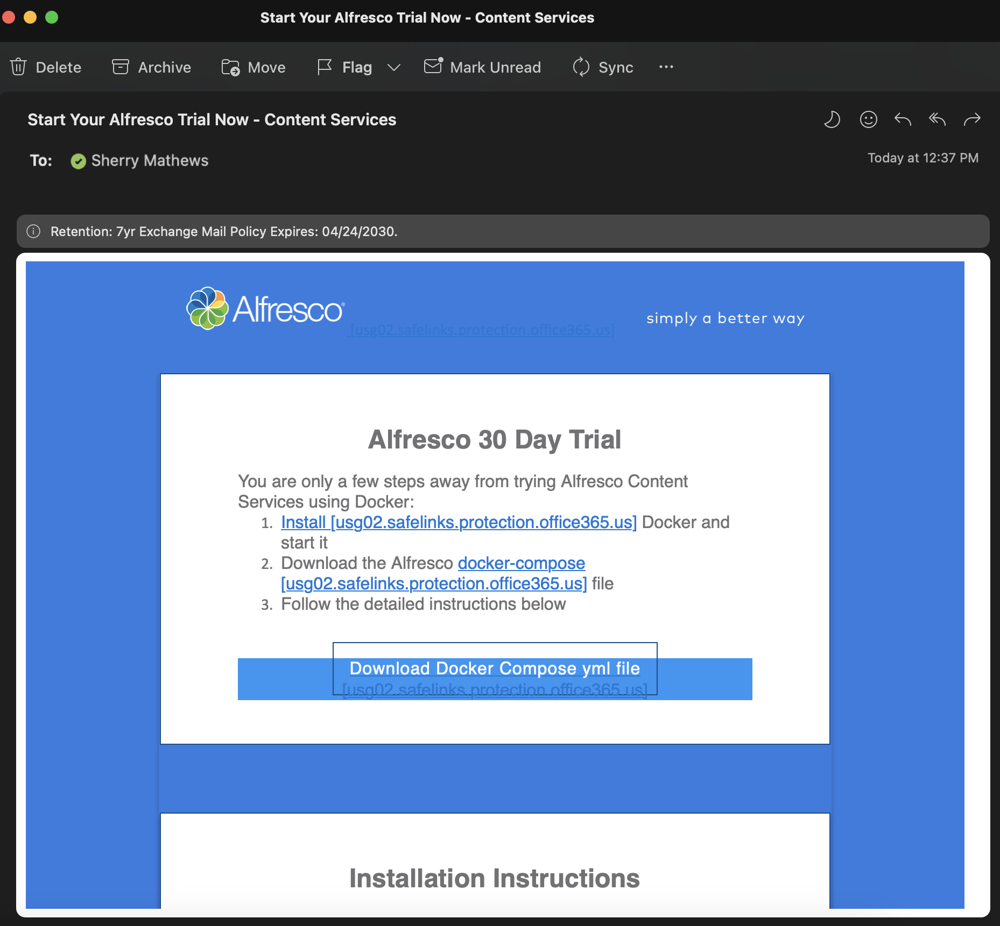
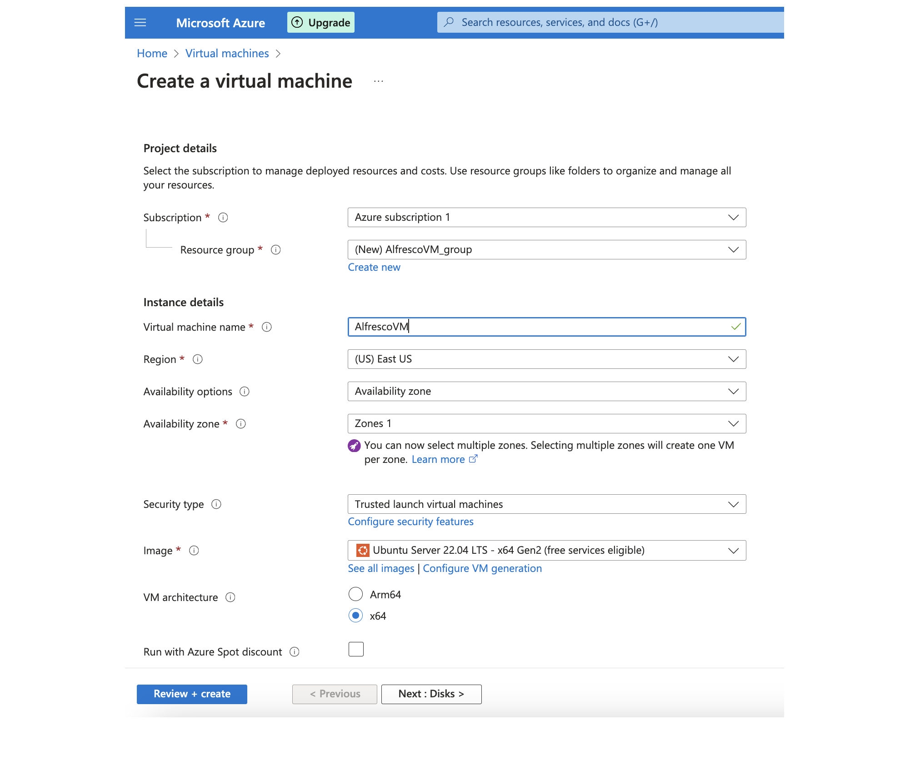

#### This article details the steps required to install Alfresco Content Services - Enterprise (ACS) on Azure Cloud using Docker Compose.

### Use-Case / Requirement
An Enterprise edition of Alfresco Content Services has to be installed using Docker Compose.

### Prerequisites to ACS Installation

* Alfresco Content Services Enterprise License - A [30-day Free trial license](https://www.alfresco.com/platform/content-services-ecm/trial/download) is also available from Alfresco.
* An [Azure - Ubuntu Linux - VM](https://azure.microsoft.com/en-us/solutions/linux-on-azure/ubuntu/) is used to install Alfresco in this article.
* Login credentials to [Quay.io](https://quay.io/repository/) that holds container images of Alfresco Enterprise Edition.
> Note: If you've requested for a [30-day Free trial license](https://www.alfresco.com/platform/content-services-ecm/trial/download), please wait for the email from Alfresco with details, as shown below.


## Installation Steps
1. Create an [Azure VM (Ubuntu Linux)](https://learn.microsoft.com/en-us/azure/virtual-machines/linux/quick-create-portal?tabs=ubuntu) instance.
   ```
   OS : Ubuntu Linux
   Version : 22.04
   Size : Standard E2s v3 (2 vcpus, 16 GiB memory)
   ```
   


2. Please configure the following after creating the Azure.
* Configure Networking Rule to accept Incoming connections from My IP address or All.
* Increase Idle Timeout by clicking the IP address from VM Home Page
* Open the VM > Click Public IP address > Add a DNS name label
* Open the VM and Update Access Control (IAM) and add the Rule for READ
* Open the Network Interface (NIC) and Update Access Control (IAM) and add the Rule for READ with IP matching to the Private IP of VM.
* Create a Bastion

3. Connect to the Azure VM.
   ```
   ssh -i "my-azure.pem" <azure-username>@.2.3.4
   ```

4. [Install Docker](https://docs.docker.com/engine/install/ubuntu/#install-using-the-repository) on the connected Azure VM.
   ```
   # Add Docker's official GPG key:
   sudo apt-get update
   sudo apt-get install ca-certificates curl gnupg
   sudo install -m 0755 -d /etc/apt/keyrings
   curl -fsSL https://download.docker.com/linux/ubuntu/gpg | sudo gpg --dearmor -o /etc/apt/keyrings/docker.gpg
   sudo chmod a+r /etc/apt/keyrings/docker.gpg

   # Add the repository to Apt sources:
   echo \
   "deb [arch="$(dpkg --print-architecture)" signed-by=/etc/apt/keyrings/docker.gpg] https://download.docker.com/linux/ubuntu \
   "$(. /etc/os-release && echo "$VERSION_CODENAME")" stable" | \
   sudo tee /etc/apt/sources.list.d/docker.list > /dev/null
   sudo apt-get update
   ```

5. Install `Docker packages` on the connected Azure VM.
   ```
   sudo apt-get install docker-ce docker-ce-cli containerd.io docker-buildx-plugin docker-compose-plugin
   ```

6. Install `docker-compose` on the connected Azure VM.
   ```
   sudo apt install docker-compose
   ```

7. [Update Permissions](https://phoenixnap.com/kb/docker-permission-denied).
   ```
   sudo groupadd -f docker
   sudo usermod -aG docker <azure-username>
   newgrp docker
   groups
   ```

8. Verify that the Docker Engine installation is successful by running the `hello-world` image.
   ```
   sudo docker run hello-world
   ```
   This command downloads a test image and runs it in a container. When the container runs, it prints a confirmation message and exits.
   <br/>

9. Verify Socker running status 
   ```
   sudo systemctl status docker.service
   ```

10. Create a folder with name `alfresco`.
   ```
   mkdir /alfresco
   cd /alfresco
   ```   

11. Upload the `docker-compose.yaml` file to the above `alfresco` folder.
   ```
   scp -i my-azure.pem docker-compose.yml <azure-username>@1.2.3.4:/home/<azure-username>/alfresco
   ```
   > Note: For 30 day Enterprise Trial, the `docker-compose.yaml` can be downloaded from the link given in the email response from Alfresco.

12. Note the login credentials to [Quay.io](https://quay.io/repository/).
    > Note: For 30 day Enterprise Trial, the `quay login username` and `quay login encrypted password` are available in the email response from Alfresco.

    > Note: Only the encrypted password has to be used.

13. Run the following command to login to Quay.io.
    ```
    docker login quay.io -u="<quay-login-username>"
    ```

14. Enter the `quay-login-encrypted-password` when prompted.
    > Note: For 30 day Enterprise Trial, the `quay login encrypted password` is available in the email response from Alfresco.

15. Run the following command to start downloading container images.
    ```
    docker-compose up -d
    ```
    > Note: It will take under 5 minutes to download images and get them started.

16. Run the following command to verify status.
    ```
    docker ps -a
    ```

17. Default username/password.
    ```
    admin/admin
    ```

### ACS : RUN the DEMO
Navigate to the following URLs to open Alfresco.
```
http://<hostname>:8080/alfresco
http://<hostname>:8080/share
```

### TIP
Special thanks to [Abhinav Kumar Mishra](https://github.com/abhinavmishra14) for sharing the Docker commands useful for installation.

Run this command to START containers
```
docker-compose up
```

Run this command to STOP containers
```
docker-compose down
```

Run this command to REBUILD with clear cache and RESTART
```
docker-compose down && docker-compose build --no-cache && docker-compose up
```

To create the external volumes use following command:
```
docker volume create <volumeName>
```

To purge the external volumes use following command:
```
docker volume rm -f <volumeName>
```

To build use following command:
To build the images, This command will ignore any images which are already built and no changes to DockerFile has been identified. It will use cache.
```
docker-compose -f ./docker-compose.yml build
```

To build the images with no cache. It will force rebuild
```
docker-compose -f ./docker-compose.yml build --no-cache
```

To launch containers use following command:
```
docker-compose -f ./docker-compose.yml up
```

To build and launch containers use following command:
```
docker-compose -f ./docker-compose.yml up --build
```

To shutdown use following command:
```
docker-compose -f ./docker-compose.yml down
```

To tail logs use following command:
```
docker-compose -f ./docker-compose.yml logs -f
```

### References
1. Alfresco Installation using Docker Compose : https://docs.alfresco.com/content-services/latest/install/containers/docker-compose/
2. How to install Docker on Amazon Linux 2 : https://www.cyberciti.biz/faq/how-to-install-docker-on-amazon-linux-2/
3. Top 15 Docker Commands : https://www.edureka.co/blog/docker-commands/
4. ACS Community Installation : https://github.com/abhinavmishra14/acs-community-71-docker
