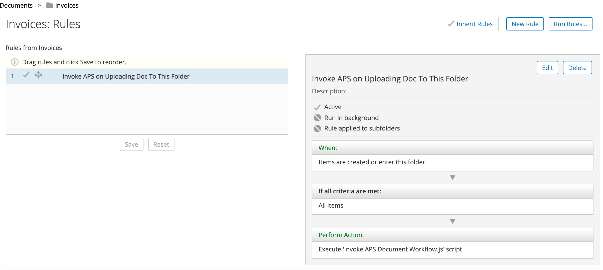

#### This article details the steps required to invoke an APS workflow/process from ACS.

### Use-Case / Requirement
An already modelled and deployed APS workflow/process has to be triggerd from ACS.

### Prerequisites to run this demo end-2-end

* Alfresco Content Services (Version 6.1 and above)
* Alfresco Process Services (Version 1.11 and above)
* [HTTP Activiti Client](assets/http_js.amp) (amp or jar)


## Configuration Steps
1. Deploy the [http_js.amp](assets/http_js.amp) file in ACS. 
   Full credits and thanks to [Rui Fernandes](https://github.com/rjmfernandes).
2. Restart ACS Container.
3. Import and Deploy the `aps-app.zip` file in APS.


## Configuration Step in ADP/Orca (if needed)
```
Location to deploy http_js.amp in ADP/Orca will be: 
adp/data/services/content/http_js.amp
```


## Custom Javascript to Invoke APS Workflow/Process

```
// Code to invoke an APS Workflow from ACS along with passing the document.
// The variables meant to receive the ACS document has to be FORM UI elements in the START FORM.

logger.info('*** Starting APS Workflow ***');

var formvariables = '{' + '"acsNodeId":"'+document.id+'"' + '}'; // acsNodeId is the id of a 'Text' UI element in the Start-Form. Hence it is the variable to receive the node-id passed from ACS.
var dataObj = eval('(' + formvariables + ')');

var processToInvoke = 'InvokeThisProcess'; // Name of process/workflow to invoke.
var instanceToCreate = 'Created from ACS'; // Name of the instance that gets created.

var receivingDocumentList = ["apsdocument"];  // apsdocument is the id of an 'Attach File' UI element in the Start-Form. Hence it is the variable to receive the document passed from ACS.

logger.info(formvariables);

try{
	activiti.startDocumentProcess(processToInvoke, instanceToCreate, dataObj, receivingDocumentList, [document]);
}
catch(ex){
	logger.error('*** Exception >>> ***'+ex.message);
}

logger.info('*** Ending APS Workflow ***');
```


## Define Folder Rules in ACS to trigger this workflow
The process flow.  
