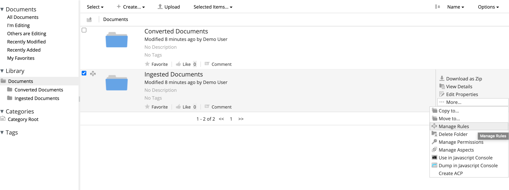
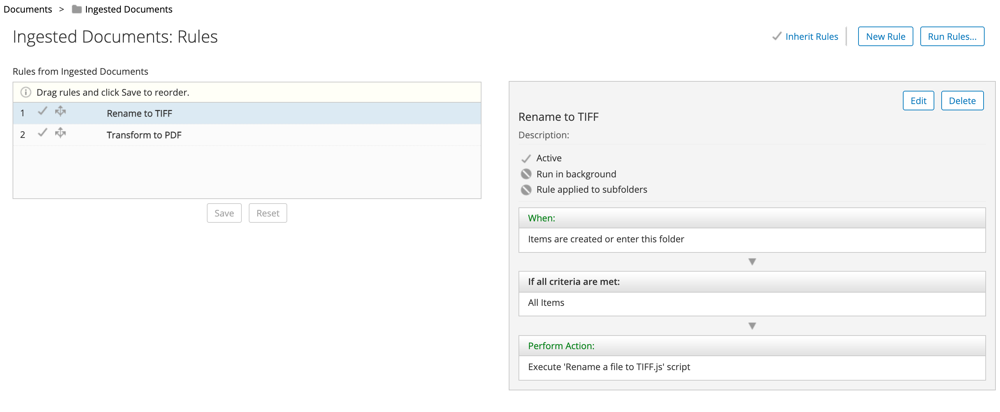
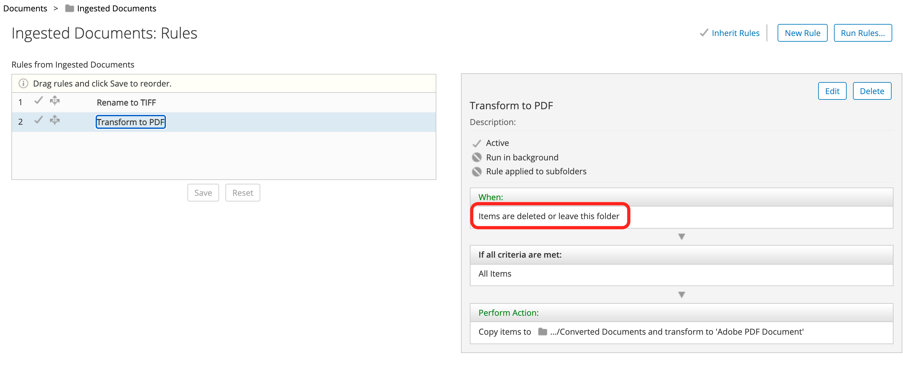
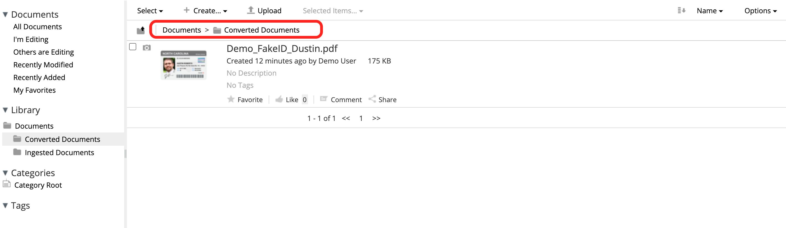

#### This article details the steps required to transform images (.jpg, .jpeg, .png etc.) to PDF file.

### Use-Case / Requirement
Transform images (.jpg, .jpeg, .png etc.) to PDF file.

### Prerequisites to run this demo end-2-end

* Alfresco Content Services (Version 6.1 and above)
* [JS Console - Repo](../javascript-console-repo-0.7-SNAPSHOT.amp)  (if running on ACS v7.x)
* [JS Console - Share](../javascript-console-share-0.7-SNAPSHOT.amp)  (if running on ACS v7.x)

## Javascript 

A simple script to transform and move file:

```javascript
transformDoc = document.transformDocument('application/pdf');


dest = companyhome.childByNamePath("Sites/sandbox/documentLibrary/Converted Documents");
logger.error(dest);
transformDoc.move(dest);
//Removal of original ingested image
//document.remove();
```

More examples:

```javascript

var fileName = ""+document.name;
logger.info('*** Original File Name >> '+fileName);

var extension = fileName.split('.')[1];
fileName = fileName.split('.')[0];

var fileFormats = ['jpg', 'jpeg', 'png']

if(fileFormats.indexOf(extension) > -1){
	document.name = fileName+".tiff";
	document.save();
}

logger.info('*** After Renaming - File Name >> '+document.name);
document.remove();
```


## Folder Rule 
* Document has to be uploaded to `Ingested Documents` folder.

* Folder Rules that changes extension to .tiff.

* Folder Rules that transform from TIFF to PDF.

* The converted document is available in the `Converted Documents` folder.



## Run the DEMO.
